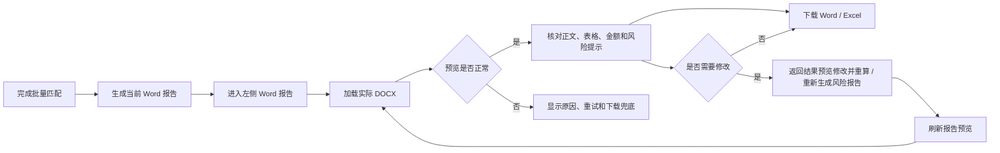
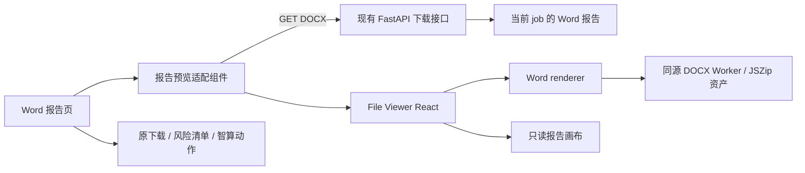

# 报告预览模块 PRD

## 模块目标

在现有左侧一级功能“Word 报告”页内增加真实 DOCX 报告预览窗口，让编制人和复核人在下载文件前即可核对报告的标题、正文、金额、表格、风险提示和基本版式，形成“生成报告 → 在线预览 → 发现问题 → 返回修改 / 重算 → 刷新预览 → 下载成果”的闭环。

本模块只负责读取和展示当前任务已经生成的 Word 报告，不重新生成报告、不解析 Excel 计算价格，也不改变任何匹配、预警、人工修改或大模型风险报告逻辑。

## 优先级

当前优先级：**P1**。

页面位置：沿用左侧一级功能菜单中的 **Word 报告**，不新增一级菜单。报告预览是现有 Word 报告页的内部能力。

## 当前现状与问题

- 当前 Word 报告页已经提供生成状态、Excel / Word 下载、风险清单和一块由前端摘要数据拼出的“报告预览”。
- 现有预览并未读取实际 `.docx`，因此不能核对 Word 中真实的段落、表格、分页、图片和风险报告写回结果。
- 用户只能下载后再用本机 Word 打开，打断了造价智算内部的编制与复核流程。
- 人工修改输出 Excel、点击“重算公式”或生成大模型风险报告后，Word 文件会更新；预览必须能识别并刷新为当前版本，不能长期展示旧报告。

## 产品决策

| 决策项 | 结论 |
| --- | --- |
| 页面入口 | 沿用左侧“Word 报告”，不新增一级模块 |
| 预览对象 | 只预览当前任务实际生成的 `.docx` |
| 组件方案 | 使用 `flyfish-dev/file-viewer` 的 React 标准组件与独立 Word renderer |
| 依赖范围 | 优先 `@file-viewer/react` + `@file-viewer/renderer-word`，不引入 `react-full` / `preset-all` 全格式包 |
| 接入方式 | 原生 React 组件接入，不使用外部在线转换服务，不以第三方网站 iframe 作为正式方案 |
| 文件来源 | 复用现有 `/api/download/{job_id}/report`，前端取回二进制并以带 `.docx` 文件名的 `File` 交给预览器 |
| 运行环境 | 开发版、Windows 绿色版、Windows Tauri 桌面版均须可用；Worker、JSZip、字体等运行资产全部同源自托管 |
| 业务边界 | 只读预览，不在网页中编辑 Word，不用预览结果反向修改 Excel、规则或计算结果 |

## 目标用户与核心场景

| 用户 | 核心场景 | 期望结果 |
| --- | --- | --- |
| 编制人 | 完成批量匹配后检查自动生成报告 | 不下载即可看到真实报告内容，确认生成是否完整 |
| 复核人 | 核对金额、风险提示和待复核摘要 | 快速判断报告是否可以交付，必要时返回结果预览处理问题 |
| 演示人员 / 评委 | 体验从规则计算到成果输出的闭环 | 在造价智算内部直接看到正式 Word 成果，不依赖外部软件切屏 |
| 运维 / 交付人员 | 在绿色版、Tauri 或内网环境检查报告 | 无公网、无 CDN 时仍能加载预览资源和报告文件 |

## 核心用户流程



## 页面信息架构

### 页面总结构

“Word 报告”页保持为一个独立成果工作区，采用“紧凑顶部工具区 + 主体真实预览窗口”的结构：

1. 顶部标题区：显示“Word 报告”、当前报告状态和当前文件名。
2. 紧凑操作区：保留下载 Word、下载 Excel、风险清单；新增刷新预览。必要的输入行数、待复核数、预警数收敛为轻量状态信息，不再占用一整列卡片。
3. 主体预览区：由 `file-viewer` 读取并渲染当前 `.docx`，尽量铺满中间工作区的剩余宽度与高度。
4. 状态 / 异常区：在同一预览窗口内处理空态、加载态、成功态、失效态和失败态，不用浏览器 `alert`。
5. 右侧“问问智算”继续保留，不遮挡报告预览；左右侧栏收起后，预览区自动获得更多空间。

### 预览窗口状态

| 状态 | 触发条件 | 页面表现 | 可执行动作 |
| --- | --- | --- | --- |
| 未生成 | 当前无任务或仍是待批量匹配预览 | 说明需先完成批量匹配和报告生成 | 返回填价工作台 / 结果预览 |
| 待加载 | 已有报告但用户尚未进入 Word 报告页 | 不提前下载重型文件和 renderer | 进入页面后自动加载 |
| 加载中 | 正在获取 DOCX 或解析渲染 | 显示“正在读取 Word 报告”和阶段性加载状态 | 可继续使用左侧导航和右侧智算 |
| 已就绪 | 实际 DOCX 渲染成功 | 显示真实报告内容和当前文件名 | 搜索、缩放、打印等按 renderer 实际可用能力展示；可下载和刷新 |
| 已更新待刷新 | 人工修改后重算、风险报告写回或报告版本变化 | 明确提示“报告已更新”，自动刷新一次或提供高可见刷新入口 | 刷新预览 |
| 加载失败 | 文件不存在、网络错误、资源缺失、解析失败或格式不支持 | 展示可读错误摘要，不暴露本机绝对路径和堆栈 | 重试、下载 Word、返回处理 |

## 功能边界

- 上游 Word 报告生成模块负责产出和更新 `.docx`；本模块只读取当前任务成果并进行只读渲染。
- 报告内容、金额、风险等级和文件版本仍以现有 FastAPI、`backend/app/report.py` 和当前 job 状态为准，File Viewer 不参与业务计算。
- 当前只支持造价智算生成的 Word 报告，不扩展为任意文件上传和全格式附件中心。
- 预览异常只能影响预览区域，不能阻断 Word / Excel 下载、填价、预警、风险清单、人工修改或问问智算。
- 网页预览用于快速核对，正式成果仍是后端生成并供用户下载的原始 `.docx`。

## 需求清单

| 状态 | 需求 | 说明 | 验收口径 |
| --- | --- | --- | --- |
| [已完成] | 在现有 Word 报告页接入真实 DOCX 预览 | 用实际文件预览替换当前由摘要字段拼出的模拟报告页；保留下载、风险清单和右侧智算 | 左侧菜单名称和顺序不变；页面内能看到本次实际生成 Word 的正文和表格；长风险正文能自动续页并完整显示，不再把摘要卡或前 3 个结构页当成完整 Word 预览 |
| [已完成] | 复用当前报告下载接口获取文件 | 通过 `/api/download/{job_id}/report` 获取二进制，使用 `summary.output_report` 或响应文件名构造带 `.docx` 扩展名的 `File` | 不向前端暴露磁盘路径；不存在时显示明确空态 / 错误；下载 Word 原功能继续可用 |
| [已完成] | 按需接入 File Viewer Word renderer | 使用 `@file-viewer/react` + `@file-viewer/renderer-word`，`rendererMode: 'replace'`，显式注入 `wordRenderer`；组件只在进入 Word 报告页且报告存在时加载 | 不安装全格式 `react-full` / `preset-all`；首页和结果预览不因 Word renderer 阻塞；React / TypeScript 构建通过 |
| [已完成] | 本地化 DOCX Worker 与依赖资产 | 同源提供 `vendor/docx/docx.worker.js`、`vendor/docx/jszip.min.js` 等实际所需资产，并使用稳定的相对 / 根路径配置 | 断开公网后，开发版、绿色版和 Tauri 桌面版均能读取报告；控制台无 Worker / JSZip 404，静态资源请求不回落为 SPA HTML |
| [已完成] | 报告版本刷新与陈旧状态治理 | job 切换、手动重算、风险报告写回后使当前预览失效；取消旧请求并重新获取当前报告，避免缓存旧 DOCX | 新任务不会显示上一个任务报告；刷新后能看到最新写回内容；重复切换不串任务、不永久转圈 |
| [已完成] | 完整加载、错误和下载兜底 | 对 HTTP 错误、空文件、格式识别失败、renderer 异常和离线资产缺失分别转成用户可理解提示 | 任一预览失败不影响 Excel / Word 下载、风险清单、填价和预警；用户始终可重试或直接下载 Word |
| [已完成] | 预览器资源与生命周期管理 | 使用 `AbortController` 取消过期获取；如创建 object URL，切换任务和卸载时必须 `URL.revokeObjectURL`；避免重复挂载 controller | 连续切换模块、连续刷新和切换任务无明显内存持续增长，无重复事件、过期内容覆盖和控制台未处理异常 |
| [已完成] | 响应式成果工作区与基础可访问性 | 预览容器有稳定高度，桌面宽度优先铺满；按钮有禁用态、焦点态和可读标签；状态不能只靠颜色 | 1366px、宽屏显示器和 Tauri 窗口下可滚动、无遮挡；左 / 右侧栏折叠后自然扩宽；键盘可聚焦顶部操作 |
| [暂缓] | 网页内编辑 Word、批注和多人协同 | 本期只做只读预览和下载，修改仍通过现有 Excel 人工修改、重算和报告生成链路完成 | 页面不出现伪编辑入口，不把浏览器预览宣称为 Word 排版编辑器 |

## 技术方案

### 组件选型

P1 采用精确裁剪方案：

```text
@file-viewer/react
@file-viewer/renderer-word
@file-viewer/vite-plugin（仅在验证确有必要时作为开发依赖，用于复制离线资产）
```

不采用 `@file-viewer/react-full` 或 `@file-viewer/preset-all`，因为当前页面只需要 Word；全格式包会引入 PDF、Excel、PPT、CAD、压缩包等本期不使用的能力。所有 File Viewer 相关包必须锁定同一套经过构建和运行验证的版本，不能混用不同版本。

推荐参数方向：

```ts
import FileViewer from "@file-viewer/react";
import { wordRenderer } from "@file-viewer/renderer-word";

const options = {
  rendererMode: "replace",
  renderers: [wordRenderer],
  theme: "light",
  docx: {
    workerUrl: "/file-viewer/vendor/docx/docx.worker.js",
    workerJsZipUrl: "/file-viewer/vendor/docx/jszip.min.js",
  },
};
```

正式实现以安装版本的官方文档和 TypeScript 类型声明为准，不得靠猜测参数名硬接。

### 文件获取与识别

1. 用户进入 Word 报告页，且 `result.downloads.report` 存在、批量匹配已完成。
2. 前端以 `fetch` 请求当前报告，设置 `cache: 'no-store'`，并用当前 `job_id + 报告刷新序号` 作为请求生命周期键。
3. 将响应读取为 `Blob`，再构造 `new File([blob], outputReportName, { type: DOCX_MIME })`；文件名必须以 `.docx` 结尾，避免 `/api/download/.../report` 无扩展名导致格式识别失败。
4. 把 `file`、`name / filename` 或 `type` 等必要信息传给 File Viewer；具体属性按实际 TypeScript 声明选择。
5. 预览成功后记录当前 job 和报告版本；失败时保留原下载地址作为兜底。

### 数据与版本边界

- 报告预览不是新的成果文件，不单独保存副本，不产生“预览版 Word”。
- 当前任务的 Word 文件仍由既有 `backend/app/report.py` 和后端路由生成 / 更新。
- 人工修改普通单元格但尚未点击“重算公式”时，应沿用现有业务提示：Word 报告可能尚未刷新；预览不得伪装成已经同步。
- 点击“重算公式”完成、风险报告成功写回或后端返回新的报告状态后，前端应使旧预览失效。
- 预览内容不得反向写入 Excel、Word 模板、二维知识库、规则表或经验池。

### 运行架构



### 开发版、绿色版与 Tauri

- 开发版：Vite `5174` 加载前端，FastAPI `8000` 提供报告；跨源获取沿用现有 API 基址和 CORS 规则。
- Windows 绿色版：运行时携带前端源码、`node_modules` 和 `public/file-viewer`；断网状态不得访问 CDN。
- Tauri 桌面版：`frontend/dist` 由 FastAPI 静态托管，Vite 构建必须把 `public/file-viewer` 完整复制到 `dist/file-viewer`，打包脚本沿用复制整个 `frontend/dist` 的现有逻辑。
- 如果使用 Vite 插件自动复制资产，必须验证生成位置和两种发布包实际路径；如果只复制 Word 所需资产，必须保证版本升级时同步更新。

## 交互与视觉规范

- 报告预览是当前页主视觉，不能再用“左侧大摘要卡 + 右侧小预览”挤压真实文档。
- 保持大尾巴主题的白底、浅灰分区、1px 细边框、低圆角和无阴影；不得套入厚重的第三方默认外壳。
- 预览器容器必须有稳定高度，推荐使用 `min-height` 与视口 / 父容器剩余高度计算，不写死只适配某一分辨率的单点高度。
- Word 纸张区域可保留浅灰工作台底和白色页面，以便区分页边界；工具栏不得覆盖正文。
- 搜索、缩放、打印、HTML 导出等按钮只展示 renderer 当前实际声明为可用的能力；下载 Word 仍以造价智算自己的按钮为主。
- 页面需提示“网页预览用于快速核对，正式排版以下载后的 Word 文件为准”，但不能用该提示掩盖明显缺字、空白或表格完全错位。

## 异常与降级策略

| 异常 | 处理策略 |
| --- | --- |
| 报告尚未生成 | 不加载 renderer，提示先完成批量匹配或重算 |
| 下载接口 404 | 显示“当前报告文件不存在或已失效”，提供重试和返回工作台 |
| HTTP / CORS 失败 | 显示获取失败；保留直接下载入口；不影响其他模块 |
| DOCX 为空或损坏 | 显示文件不可读取；允许下载后用 Word 检查 |
| Worker / JSZip 资产 404 | 明确记录“预览资源加载失败”，开发态控制台保留技术信息，用户界面不展示绝对路径或堆栈 |
| renderer 解析异常 | 捕获组件错误并卸载失败实例，展示重试 / 下载兜底 |
| 新任务覆盖旧请求 | 取消旧请求；旧响应即使晚返回也不得写入新任务状态 |
| 预览与下载内容不一致 | 以同一报告接口重新获取；禁用浏览器缓存；仍不一致时显示待复核并记录问题 |

## 性能、安全与合规要求

- 预览器及 Word renderer 必须按需加载，不得把全部格式能力塞入首页首包。
- DOCX 解析优先走官方 Worker，避免大文档解析长时间阻塞 React 主线程。
- 不向第三方云服务、在线 Office 或 CDN 上传报告；所有文件和运行资产在本机 / 内网处理。
- 前端只使用当前 API 返回的文件，不接受任意本机路径参数，不拼接未校验的服务端路径。
- 不在日志中写入报告全文、敏感价格明细、绝对路径或密钥；错误日志只记录 job、阶段、错误类型和脱敏摘要。
- 第三方包按 Apache-2.0 使用，发布包应保留必要的许可证说明；版本升级前重新核对许可证与变更记录。

## 验收口径

### 功能验收

- 完成批量匹配后进入左侧“Word 报告”，无需下载即可看到当前任务实际 `.docx`。
- 预览能显示当前正式模板中的标题、正文段落、核心金额、费用表格、匹配摘要和已写入的风险提示；内容顺序可读，不出现整页空白或核心表格丢失。
- 下载 Word、下载 Excel、风险清单、返回结果预览、右侧问问智算等现有功能正常。
- 人工修改后点击“重算公式”，或生成风险报告成功写回后，刷新预览能看到最新报告内容。
- 切换到新 job 后不会残留上一个任务报告。
- 预览失败时仍可直接下载 Word，且不会导致整个 React 页面白屏。

### 兼容性验收

- 传统开发版 `5174 + 8000` 可用。
- Windows 绿色版断网运行可用。
- Tauri 桌面版使用 `frontend/dist` 静态资源时可用。
- Chrome / Edge 当前项目支持版本可用；1366px 笔记本、宽屏浏览器和 Tauri 常规窗口下无明显遮挡和横向页面级溢出。

### 回归验收

- `npm run frontend:build` 通过。
- 与报告相关的前端测试 / 新增单元测试通过；至少覆盖未生成、加载中、成功、404、解析失败、job 切换和刷新七类状态。
- `python -m pytest backend/tests -v` 通过；即使本次默认不改后端，也用于确认报告下载、重算和风险写回链路未被破坏。
- 对开发版、绿色版和 Tauri 的静态资产路径至少各做一次实际网络请求检查，确认 Worker / JSZip 返回 JavaScript 而不是 404 或 `index.html`。
- `python tools/check_prd_consistency.py --strict` 通过。

## 明确不做

- 不新增左侧“报告预览”一级菜单。
- 不在浏览器里编辑 `.docx`、保存 Word 批注或替代 Microsoft Word。
- 不引入 LibreOffice / OnlyOffice 等服务端转换或在线 Office 服务。
- 不让大模型读取预览页面后重新计算或裁决价格、系数和风险等级。
- 不用 File Viewer 顺带预览 Excel、PDF、PPT、CAD 或压缩包；其他格式需另立需求。
- 不因接入预览器重构 `backend/app/report.py`、匹配引擎、人工修改或经验池预警。

## 风险与应对

| 风险 | 影响 | 应对 |
| --- | --- | --- |
| DOCX 浏览器渲染与 Microsoft Word 存在细节差异 | 页眉页脚、分页、字体或复杂表格可能不完全一致 | 将其定位为快速核对；用真实模板和典型成果验收；正式排版仍以下载 Word 为准 |
| Worker 资产未进入绿色版 / Tauri | 开发环境正常，交付环境空白 | 资产同源自托管；构建后检查 `dist/file-viewer`；对三种运行形态分别验收 |
| 包体和首屏性能回退 | 影响填价工作台打开速度 | 单 Word renderer、动态加载、只在报告页请求文件，不使用 full / preset-all |
| 报告写回后浏览器缓存旧文件 | 用户看到过期风险提示或金额 | `cache: 'no-store'`、报告刷新序号、job 生命周期键和显式刷新 |
| File Viewer 版本升级改变 API / 资产目录 | 后续构建失败或离线资源失效 | 锁定同版本依赖，检查 TypeScript 类型与上游 changelog，升级时跑真实报告回归 |

## 关联资产

| 类型 | 文件 | 用途 |
| --- | --- | --- |
| 上游模块 PRD | `00-PRD/01-模块PRD/06-Word报告生成/PRD.md` | 约束报告生成、金额一致性、风险写回和职责边界 |
| 全局 UI 总纲 | `00-PRD/03-整体UI设计PRD.md` | 约束 Word 报告页在三栏工作台中的位置和主视觉 |
| UI 执行规范 | `00-PRD/03-UI设计规范.md` | 约束响应式、颜色、边框、按钮、滚动和验证口径 |
| 前端页面 | `frontend/src/App.tsx` | 现有左侧 Word 报告页、下载、风险清单和任务状态入口 |
| 前端样式 | `frontend/src/styles.css` | 现有 `daweiba-report-*` 样式和大尾巴主题作用域 |
| 前端依赖 | `frontend/package.json` | 增加并锁定 File Viewer React / Word renderer 依赖 |
| 后端下载 | `backend/app/main.py` | 现有 `/api/download/{job_id}/report`、重算和风险报告写回接口 |
| 报告生成 | `backend/app/report.py` | 生成和更新当前任务 DOCX，预览模块只读取其成果 |
| Word 模板 | `03-知识库-二维数据库制作/01-报告模板-招标控制价报告模板/【模板勿动】控制价报告模板-yyyy-mm-dd.docx` | 真实版式和内容回归样例 |
| 绿色版构建 | `tools/build_green_release.py` | 验证前端源码、依赖和本地预览资产随包携带 |
| Tauri 构建 | `tools/build_tauri_release.py` | 验证 `frontend/dist` 及预览静态资产进入桌面版 |

## 外部技术依据

- [flyfish-dev/file-viewer GitHub 仓库](https://github.com/flyfish-dev/file-viewer)：确认其为浏览器原生、纯前端、支持 React、内网和私有化部署的文件预览组件。
- [React 标准组件说明](https://github.com/flyfish-dev/file-viewer/tree/main/packages/components/react)：确认 `@file-viewer/react` 支持 `url`、`file`、`name / filename`、`type`、`options` 等入口，可按 renderer 精确装配。
- [Word renderer 说明](https://github.com/flyfish-dev/file-viewer/tree/main/packages/renderers/word)：确认 `wordRenderer`、`rendererMode: 'replace'`、DOCX Worker 及 `workerUrl / workerJsZipUrl` 的离线资产配置方式。
- [File Viewer 官方文档](https://doc.file-viewer.app/)：确认标准组件 + 最小 renderer / preset 是生产项目的推荐边界，Worker / WASM / 字体等资产支持自托管。
- [Apache-2.0 许可证](https://github.com/flyfish-dev/file-viewer/blob/main/LICENSE)：用于第三方依赖合规确认。

外部能力调研日期：2026-07-10。正式开发时仍需以实际安装版本的类型声明、官方文档和 changelog 复核。
