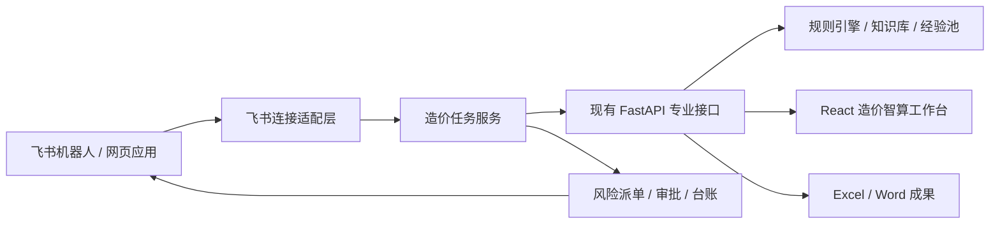

# 智能协同 PRD

## 模块目标

“智能协同”是造价智算连接飞书的组织协同与流程功能页。它把飞书作为造价智算的组织协同与流程触达层，把现有造价智算作为规则计算、专业复核、知识检索和成果生成引擎，使一项造价任务能够从飞书发起，经过材料接收、规则处理、风险复核、成果审批和交付归档形成闭环。

本模块不是把现有造价智算全部重做在飞书里，也不是让飞书机器人或大模型直接裁决价格。飞书负责连接人员、消息、任务、文件、审批和提醒；现有 FastAPI、React、二维知识库、规则表、经验池和 Word / Excel 处理能力继续承担专业业务逻辑。

## 优先级

当前优先级：**P1**。

对外模块名：**智能协同**。

页面位置：造价智算左侧一级功能菜单，固定排列在“知识库问答”下方。

P1 最小目标是完成一个可验证的飞书连接闭环：用户可以在飞书中创建造价任务、提交标准 Excel、收到处理进度和结果摘要，并能通过安全链接进入造价智算网页工作台继续表格复核，完成后由飞书返回成果文件和待复核提醒。

P1 不要求一次性完成完整企业级造价平台。复核派单、审批发布、多维表格管理台账和管理驾驶舱在最小闭环稳定后分批增强，但仍归属于本 P1 模块的后续验收范围。

## 产品定位

### 一句话定位

> 飞书里的工程造价任务入口、协同助手和流程管家。

## 页面定位与信息架构

“智能协同”是造价智算主界面中的独立一级功能页，不只是藏在设置中的飞书连接开关。用户点击左侧“智能协同”后，中间工作区切换到协同任务页，右侧“问问智算”仍作为随行助手保留。

左侧一级功能菜单顺序为：

`填价工作台 → 结果预览 → 经验池预警 → 工作量抓取 → 报告生成和预览 → 知识库问答 → 智能协同`

P1 页面至少包含：

- 页面标题和飞书连接状态。
- “新建协同任务”主动作。
- 我的任务 / 待我复核 / 待我审批等轻量筛选。
- 任务列表：任务名称、任务编号、场景、状态、负责人、更新时间、待复核数和截止时间。
- 当前任务详情：材料版本、处理进度、风险摘要、复核状态、审批状态和成果入口。
- 进入专业工作台、发送飞书提醒、重新同步和查看操作记录等动作。
- 未配置飞书时的清晰空态和配置指引；未配置状态不得影响本地填价、预警、问答和成果输出。

“智能协同”页面只承载任务与组织协同信息。需要逐行查看、编辑 Excel 或选择价格 / 系数候选时，继续进入结果预览和辅助填价弹窗，不在协同页面复制专业表格工作台。

### 角色分工

| 层级 | 主要职责 | 不承担的职责 |
| --- | --- | --- |
| 飞书协同层 | 任务发起、人员识别、材料收取、状态通知、复核派单、审批和成果触达 | 不执行价格和系数裁决，不承载复杂 Excel 编辑 |
| 造价任务层 | 维护任务编号、状态、输入版本、运行记录、风险、复核意见和成果关系 | 不改变底层专业规则 |
| 造价智算专业引擎 | Excel 读取、三数字匹配、经验池预警、风险清单、知识问答、Word / Excel 输出 | 不自行批准成果，不替代人工复核 |
| 大模型解释层 | 材料摘要、依据解释、风险说明、通知文案和意见草稿 | 不生成最终单价、系数、审减金额或正式审批结论 |

## 目标用户与角色

| 角色 | 主要动作 | 权限边界 |
| --- | --- | --- |
| 任务发起人 | 新建任务、上传材料、查看本人任务状态 | 默认只能查看本人发起或被授权的任务 |
| 编制人 | 检查材料、执行匹配、处理待复核项、生成成果 | 可修改输出副本，不得直接修改正式规则资产 |
| 复核人 | 接收风险任务、查看依据、确认、修改、挂起或退回 | 不得绕过留痕直接发布成果 |
| 审批人 | 审批成果发布或退回修改 | 审批结论不反向改写专业规则和计算结果 |
| 规则维护人 | 处理知识候选、规则缺口和标准出处问题 | 规则变更必须独立审批并运行回归测试 |
| 管理者 | 查看任务进度、风险分布和闭环情况 | 默认不查看无业务必要的逐行敏感价格数据 |
| 系统管理员 | 配置飞书应用、权限、身份映射和运行环境 | 不拥有业务结果的专业审批权 |

## P1 场景范围

### 场景 A：从飞书新建造价任务

用户在单聊机器人、指定群聊或飞书网页应用中发起“新建造价任务”，选择当前已支持的“长输管道勘察测量最高投标限价编制”场景，填写项目名称、任务说明和期望完成时间，并上传标准 Excel。

系统生成唯一任务编号，将飞书用户、飞书会话、任务编号和后端 job 关联起来，返回任务卡片。

### 场景 B：飞书接收进度和结果

造价智算开始读取、生成待匹配预览、执行批量匹配或运行预警后，飞书消息卡片同步显示阶段、进度、待复核数、高低风险数和下一步动作。

复杂表格复核不直接放入飞书消息卡片。用户点击“进入造价智算复核”后，打开对应任务和 job 的网页工作台。

### 场景 C：风险派单和人工复核

结构化风险清单可按任务分配给复核人。飞书只发送必要的风险摘要、任务链接和截止时间；复核人进入造价智算查看完整行数据、候选、依据和修改记录。

### 场景 D：成果审批与交付

当任务满足发布条件后，可发起飞书成果发布审批。审批通过后，系统将正式 Excel、Word 报告、风险摘要和依据清单发送给有权限的用户或保存到受控位置，并把任务状态更新为已发布。

### 场景 E：归档与经验候选

任务归档后，人工确认记录只进入知识 / 经验候选层。未经规则维护人治理和审批，不得自动写入正式二维知识库、程序规则或经验池。

## 需求清单

| 状态 | 需求 | 说明 | 验收口径 |
| --- | --- | --- | --- |
| [待开发] | 飞书自建应用与身份接入 | 建立机器人或网页应用入口，使用飞书用户身份映射任务权限；本地试点优先使用官方 SDK 长连接 | 指定范围内用户可使用应用；未授权用户无法读取任务；应用凭证不进入前端和代码仓库 |
| [待开发] | 飞书任务创建与状态机 | 从飞书创建造价任务，生成唯一任务编号并关联会话、用户、输入版本和后端 job | 重复事件不会重复建任务；任务状态按统一状态机流转；每次状态变化有时间和操作者 |
| [待开发] | 材料接收与受控存储 | 接收标准 Excel 和必要附件，检查文件类型、大小、重复提交和基本完整性 | 原始文件不被覆盖；文件进入独立任务目录或受控存储；多次上传形成版本而不是相互覆盖 |
| [待开发] | 专业引擎调用与进度消息 | 飞书调用现有造价智算主流程，异步反馈读取、待匹配、批量匹配、预警和成果生成阶段 | 长任务不阻塞飞书事件回调；卡片状态与后端任务一致；失败时说明阶段、原因和可重试动作 |
| [待开发] | 智能协同功能页与安全跳转 | 左侧菜单在“知识库问答”下方新增“智能协同”，展示任务列表、状态、风险、复核、审批和成果入口；飞书消息卡片可进入对应任务 | 中间区只显示智能协同主体；右侧问问智算继续保留；打开后定位正确任务和 job；无权限用户无法仅凭链接访问；复杂编辑不在协同页和聊天卡片内实现 |
| [待开发] | 风险派单与复核提醒 | 把结构化风险清单按任务分配给复核人，支持截止时间、提醒、处理状态和进入目标行 | 飞书摘要可跳转到正确 sheet / 行；风险卡片不直接改值；处理动作继续复用人工留痕和复核边界 |
| [待开发] | 多维表格任务与风险台账 | 将必要的任务元数据、状态、负责人、风险数量和成果链接同步到多维表格管理视图 | 不同步完整价格库和无必要逐行敏感数据；飞书台账与内部任务状态可核对；同步失败可重试 |
| [待开发] | 成果审批与发布 | 复核完成后发起飞书审批，审批通过后发布有权限的 Excel、Word 和摘要成果 | 存在未关闭高风险时按配置阻止或明确警示发布；审批回调幂等；退回后任务回到可处理状态 |
| [待开发] | 成果返回、归档和版本识别 | 通过飞书发送成果通知和受控下载入口，记录发布版本、审批状态和归档位置 | 用户能区分草稿、待审批版和正式发布版；不得出现多个无法区分的“最终版” |
| [待开发] | 权限、安全与统一留痕 | 记录飞书关键操作、任务状态、文件版本、复核和审批事件，实施最小权限和敏感信息控制 | 不在群消息暴露完整敏感价格；日志只追加；凭证脱敏；飞书不可用时本地专业主流程仍可运行 |

## P1 分期

### P1-A：连接可行性与最小任务闭环

- 创建企业自建应用。
- 使用飞书官方 SDK 建立事件长连接。
- 完成用户身份获取和最小权限申请。
- 在飞书创建任务并上传一个标准 Excel。
- 调用现有造价智算读取 / 匹配流程。
- 返回任务状态、结果摘要和工作台链接。
- 返回 Excel、Word 成果或受控下载入口。

P1-A 验收重点是“能跑通、不会重复、失败可恢复”，不追求复杂视觉卡片和管理驾驶舱。

### P1-B：风险复核协同

- 同步结构化风险摘要。
- 指定复核人和截止时间。
- 从飞书跳转到目标任务、sheet 和行。
- 同步复核处理状态。
- 增加未处理风险提醒和超期提醒。

### P1-C：审批、台账与发布闭环

- 建立多维表格任务台账。
- 接入成果发布审批。
- 审批通过后生成正式发布记录。
- 完成成果归档、版本识别和关键操作留痕。
- 输出基础管理统计。

## 任务状态机

| 状态 | 进入条件 | 可执行动作 | 退出条件 |
| --- | --- | --- | --- |
| 待收件 | 飞书创建任务但未收到有效主输入 | 上传、补充、取消 | 收到可识别的标准 Excel |
| 材料待补充 | 文件存在但缺少必填信息或无法识别 | 补充材料、修改任务信息、转人工 | 材料检查通过 |
| 待计算 | 材料检查通过 | 开始处理、取消 | 后端 job 创建成功 |
| 计算中 | 造价智算正在读取、匹配或生成成果 | 查看进度、等待、失败重试 | 完成或失败 |
| 待复核 | 已生成结果且存在待复核或风险项 | 派单、进入工作台、人工处理 | 按发布条件完成必要复核 |
| 复核中 | 已分配复核人或已有处理动作 | 确认、修改、挂起、退回 | 风险关闭或退回重算 |
| 待审批 | 已满足发布前置条件 | 发起审批、撤回 | 审批通过或退回 |
| 已发布 | 审批通过并生成发布记录 | 下载、发送、申请更正 | 完成归档或进入更正流程 |
| 已归档 | 成果和过程记录完成归档 | 查询、复盘、创建知识候选 | 原任务不再直接修改 |
| 失败 | 任一自动阶段出现不可继续错误 | 查看原因、重试、转人工 | 重试成功或任务取消 |

## 核心数据对象

### 造价任务

至少包含：

- `task_id`：内部唯一任务编号。
- `scene_type`：业务场景，P1 固定支持勘察测量最高投标限价编制。
- `title`：项目 / 任务名称。
- `status`：当前任务状态。
- `initiator`、`compiler`、`reviewer`、`approver`：角色身份。
- `feishu_tenant_key`、`feishu_chat_id`、`feishu_user_id`：必要的飞书关联标识。
- `job_id`：当前造价智算运行任务标识。
- `input_versions`：输入材料版本。
- `risk_summary`：风险数量与状态摘要。
- `output_versions`：成果版本及发布状态。
- `created_at`、`updated_at`、`deadline`：关键时间。

### 飞书事件记录

至少包含：

- 飞书事件唯一标识。
- 事件类型。
- 接收时间和处理状态。
- 关联任务。
- 重试次数。
- 脱敏后的错误摘要。

飞书事件可能重复投递，必须使用事件唯一标识或业务幂等键避免重复创建任务、重复发布成果和重复推进审批。

### 文件版本

每次上传、计算、人工修改、重算和正式发布都必须区分版本。原始输入只读保存，运行输出和正式成果分别管理，不得覆盖原始材料。

### 风险与复核记录

复用现有结构化风险清单和辅助填价人工留痕，并增加任务、责任人、处理状态、截止时间和飞书提醒记录。飞书只存储必要摘要和跳转关系，完整专业数据继续由造价智算管理。

## 系统架构

### 飞书连接适配层

只负责飞书鉴权、事件接收、消息与卡片发送、文件传输、审批回调和 API 错误转换，不放置价格匹配和造价规则。

### 造价任务服务

负责任务状态机、角色、文件版本、job 关联、风险处理状态、成果版本和操作留痕。P1 可以采用轻量存储实现，但接口和数据结构必须为后续数据库化保留清晰边界。

### 现有专业接口

继续复用当前 FastAPI 接口和业务模块。为飞书新增能力时，应通过清晰 API 调用现有功能，不把业务逻辑复制到机器人事件处理代码中。

### 网页工作台

继续承担多 sheet 表格预览、列设置、人工改值、辅助填价、行级复核和复杂风险查看。飞书消息卡片只承载摘要和轻量动作。

## 关键数据流

1. 飞书接收到新建任务请求或文件事件。
2. 连接适配层验证租户、用户、权限和事件幂等性。
3. 造价任务服务创建任务、保存输入版本并返回任务编号。
4. 异步工作进程调用现有造价智算接口，事件回调快速确认，不在回调线程执行长任务。
5. 每个业务阶段更新内部状态，再推送飞书消息卡片。
6. 用户进入网页工作台完成复杂复核，处理结果回写任务服务。
7. 满足发布条件后创建飞书审批或发布动作。
8. 审批结果通过幂等回调更新任务状态并生成正式成果记录。

## 异常处理与可靠性

| 异常 | 处理原则 |
| --- | --- |
| 飞书事件重复投递 | 使用事件唯一标识和业务幂等键，重复事件返回已处理结果，不重复建任务 |
| 飞书长连接暂时断开 | 自动重连；未发出的通知进入重试队列；本地专业主流程不回滚 |
| 文件下载或上传失败 | 保留任务和已接收版本，明确提示重试，不创建空任务输出 |
| 文件格式无法识别 | 进入“材料待补充”，返回可理解的检查结果和工作台入口 |
| 后端处理失败 | 任务进入失败状态，记录失败阶段；不发布半成品为正式成果 |
| 消息发送失败 | 不改变内部业务状态，记录失败并重试；用户重新打开任务可看到真实状态 |
| 网页链接被转发 | 服务端再次校验飞书身份和任务权限，不能仅凭 URL 访问 |
| 审批事件重复或乱序 | 按审批实例、任务和事件标识幂等处理；已发布版本不得被旧回调降级 |
| 飞书 API 权限被收回 | 失败关闭对应能力并通知管理员，不降级为匿名或越权访问 |

## 权限与安全边界

- 飞书应用必须采用最小权限原则，只申请 P1 实际使用的消息、用户、文件、审批或多维表格权限。
- App ID、App Secret、Encrypt Key、Verification Token、访问令牌等凭证只放入环境变量或受控配置，不进入前端、源码、日志和代码存档。
- 任务链接必须绑定用户身份和任务权限，不使用永久匿名下载链接。
- 群聊只展示项目名称、状态、数量和必要摘要；完整价格、规则明细和风险详情默认进入受控网页工作台查看。
- 多维表格只保存任务元数据和必要统计，不复制完整二维价格知识库、经验池和逐行敏感结果。
- 原始文件、输出副本、正式发布版和归档版必须分开管理。
- 飞书操作日志和内部任务日志只追加，不允许普通用户修改历史记录。
- 大模型处理飞书文本或附件前继续遵守现有证据和数据边界；不得因为从飞书发起而扩大数据发送范围。
- 企业管理员、系统管理员和业务审批人是不同角色，系统管理员不能替代业务人员作出专业审批结论。

## 与现有模块关系

| 模块 | 关系 | 边界 |
| --- | --- | --- |
| Excel 填价与三数字匹配 | 飞书任务调用现有读取、待匹配和批量匹配流程 | 不在飞书侧复制或放宽匹配规则 |
| 填价结果预览与输出 | 飞书卡片跳转到当前任务的表格预览和输出副本 | 复杂表格编辑仍在网页工作台完成 |
| 经验池预警 | 向飞书提供风险数量和必要摘要 | 飞书提醒不改变预警等级和经验池数据 |
| 问问智算 AI 助手 | 复用依据解释、风险说明和功能问答 | 飞书机器人不新增一套独立自由裁决逻辑 |
| 整体 UI 与导航 | “智能协同”作为左侧一级功能页，位于“知识库问答”下方 | 不改变大尾巴主题、三栏布局和右侧随行助手定位 |
| 原始工作量抓取 | 可作为任务内的独立处理步骤 | P1 不要求直接在飞书卡片内完成字段映射 |
| Word 报告生成 | 为飞书成果发布和审批提供正式报告 | 审批不修改报告金额和匹配结果 |
| 运行入口 | P1 本地试点可连接当前 FastAPI 服务；生产环境需常驻部署 | 不把个人电脑运行态当作正式生产方案 |
| 辅助填价与人工复核闭环 | 为风险派单和人工处理提供候选、确认和留痕 | 飞书卡片只负责通知和跳转，不直接写入价格 |

## 功能边界

- 不把飞书做成新的价格匹配引擎。
- 不把“智能协同”做成第二套结果预览或辅助填价页面。
- 不把复杂 Excel 编辑、列映射和候选选择塞进消息卡片。
- 不让大模型通过飞书消息直接生成或确认最终价格、单价、系数或审减金额。
- 不因接入飞书而改变现有三个数字的匹配优先级、颜色和待复核口径。
- 不把完整二维知识库、经验池和敏感逐行结果复制到多维表格。
- 不让未经治理的人工确认结果自动反写正式知识库、规则表或经验池。
- 不在 P1 一次性建设完整多租户 SaaS、计费体系、外部客户门户和跨企业协作网络。
- 不要求当前桌面版、绿色版和本地开发版停止使用；飞书入口是新增协同入口，不替代现有运行入口。
- 不新增与现有问问智算并行、互相冲突的第二套 AI 路由规则。
- 不把飞书接入失败变成 Excel、Word 和本地主流程不可用的单点故障。

## 验收口径

### P1-A 最小闭环验收

- 指定飞书用户可以创建一个勘察测量最高投标限价编制任务，并获得唯一任务编号。
- 用户提交标准 Excel 后，原始文件被安全保存，不覆盖其他任务或旧版本。
- 系统能调用现有造价智算流程生成待匹配或已匹配结果。
- 飞书消息能显示处理中、待复核、已完成或失败等真实状态。
- 用户点击飞书卡片能进入正确任务的造价智算网页工作台。
- 未授权用户即使获得链接，也不能访问任务数据和成果文件。
- 处理成功后，用户能收到结果摘要和 Excel / Word 成果或受控下载入口。
- 同一个飞书事件重复投递时，不得重复创建任务、重复处理文件或重复发布成果。
- 飞书暂时不可用时，本地开发版、绿色版和桌面版的专业主流程仍可使用。

### P1-B 复核协同验收

- 待复核和风险项能按任务生成摘要并分配给复核人。
- 飞书风险提醒可跳转到对应任务、sheet 和行。
- 风险处理结果继续保留来源、原值、新值、人工说明、操作者和时间。
- 未关闭高风险的任务不得被静默标记为复核完成。

### P1-C 审批发布验收

- 任务满足发布条件后可以发起成果审批。
- 审批通过、退回和撤回能够正确更新内部任务状态。
- 正式成果有唯一发布版本、审批记录和归档位置。
- 多维表格任务台账与内部任务状态不存在长期静默分歧；同步失败有告警和重试记录。

## 成功指标

P1 试点至少记录：

- 飞书任务创建成功率。
- 文件接收和专业引擎调用成功率。
- 首次状态反馈耗时。
- 状态卡片与内部任务状态一致率。
- 从飞书进入工作台的成功率。
- 待复核项完成率和平均处理时长。
- 成果发布成功率。
- 重复事件引发的重复任务数，目标为 0。
- 越权访问和敏感信息泄露事件数，目标为 0。

## 上线前置条件

- 企业管理员允许创建并发布企业自建应用。
- 明确 P1 试点用户范围和业务负责人。
- 确认飞书应用所需权限及其审批人。
- 确认本地试点电脑可持续联网，或提供常驻测试服务器。
- 明确真实业务文件能否进入飞书、允许传输哪些摘要以及必须留在本地的敏感资产。
- 现有造价智算主流程、风险清单、成果输出和工作台链接具备可复用接口。
- 在生产化前确定服务部署、备份、日志、监控、数据保留和清理策略。

## 关联资产

| 类型 | 文件 | 用途 |
| --- | --- | --- |
| 产品总览 | `00-PRD/00-产品总览.md` | 工程造价辅助智能体、三链融合和“先助手后平台”总体定位 |
| 当前版本计划 | `00-PRD/02-当前版本计划.md` | 本模块 P1 优先级和当前阶段边界 |
| 战略评估 | `00-PRD/PRD-sol建议-2026年7月10日/06-项目战略评估与未来功能路线-2026-07-10.md` | 飞书连接的场景智能体总体设想和分阶段路线来源 |
| 问问智算 PRD | `00-PRD/01-模块PRD/04-问问智算AI助手/PRD.md` | 消息路由、知识库问答、风险解释和大模型不越权边界 |
| 运行入口 PRD | `00-PRD/01-模块PRD/07-桌面端与评委版/PRD.md` | 本地、绿色版、桌面版和平台化服务接口边界 |
| 人工复核 PRD | `00-PRD/01-模块PRD/09-辅助填价与人工复核闭环/PRD.md` | 候选确认、复核状态、风险入口和人工留痕 |
| 后端服务 | `backend/app/main.py` | 当前 FastAPI API、job、风险、预览和成果接口入口 |
| 风险清单 | `backend/app/risk_items.py` | 飞书风险摘要、派单和跳转定位的数据来源 |
| 大模型接口 | `backend/app/llm.py` | 飞书中的解释、摘要和意见草稿能力，继续遵守不裁决数字边界 |
| 前端工作台 | `frontend/src/App.tsx` | 飞书安全跳转后的复杂表格预览、人工复核和成果操作入口 |
| 项目默认配置 | `config/project-default-settings.json` | 后续飞书模块的非敏感项目默认设置可参考现有集中配置方式 |

## 飞书官方能力参考

- [飞书应用类型与能力](https://open.feishu.cn/document/home/app-types-introduction/overview)
- [消息管理概述](https://open.feishu.cn/document/server-docs/im-v1/message/intro)
- [飞书审批概述](https://open.feishu.cn/document/server-docs/approval-v4/approval-overview?lang=zh-CN)
- [三方审批定义概述](https://open.feishu.cn/document/server-docs/approval-v4/external_approval/overview?lang=zh-CN)
- [多维表格元数据](https://open.feishu.cn/document/server-docs/docs/bitable-v1/app/get?lang=zh-CN)
- [云文档权限概述](https://open.feishu.cn/document/server-docs/docs/permission/overview)
- [使用长连接接收事件](https://open.feishu.cn/document/server-docs/event-subscription-guide/event-subscription-configure-/request-url-configuration-case?lang=zh-CN)

## 实施前决策项与默认口径

- 主入口默认先采用机器人单聊，指定项目群只接收进度和风险通知；飞书网页应用作为进入完整任务列表和专业工作台的补充入口。
- 文件安全默认先用脱敏样例完成 P1-A；企业明确真实控制价文件可进入飞书后再开放真实文件上传。未获许可时，飞书只建任务，文件在造价智算工作台上传。
- 首批试点默认控制在一个业务小组内，至少覆盖任务发起人、编制人和复核人；审批人在 P1-C 接入时再纳入。
- P1-A 默认使用当前 Windows 环境和飞书长连接完成技术试点；进入稳定试用或真实业务前，迁移到企业内常驻测试服务器。
- 成果发布默认在 P1-A / P1-B 阶段标记为“试算成果 / 待人工确认”；P1-C 接入飞书原生审批后，只有审批通过的版本可以标记为正式发布版。
