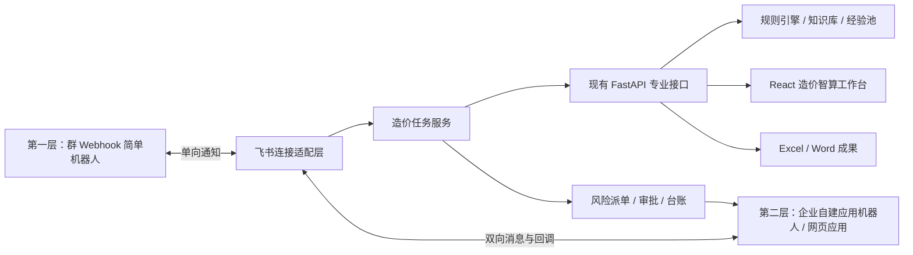

# 智能协同 PRD

## 模块目标

“智能协同”是造价智算连接飞书的组织协同与流程功能页。它把飞书作为造价智算的组织协同与流程触达层，把现有造价智算作为规则计算、专业复核、知识检索和成果生成引擎，使一项造价任务能够从飞书发起，经过材料接收、规则处理、风险复核、成果审批和交付归档形成闭环。

本模块不是把现有造价智算全部重做在飞书里，也不是让飞书机器人或大模型直接裁决价格。飞书负责连接人员、消息、任务、文件、审批和提醒；现有 FastAPI、React、结构化计价库、规则表、经验池和 Word / Excel 处理能力继续承担专业业务逻辑。

## 优先级

当前优先级：**P1**。

对外模块名：**智能协同**。

页面位置：造价智算左侧一级功能菜单，固定排列在“知识库问答”下方。

P1 按两层顺序建设：第一层先做只能向指定群推送消息的 Webhook 简单机器人，快速验证造价智算向飞书发送开始、进度、失败、完成和结果摘要通知；第二层再建设企业自建应用形态的复杂全功能机器人，实现从飞书收消息、收文件、识别用户、创建任务、风险派单、审批和成果发布。

第一层验收通过后才能进入第二层。P1 不要求一次性完成完整企业级造价平台，但两层都属于“智能协同”P1 的正式范围。

## 产品定位

### 一句话定位

> 飞书里的工程造价任务入口、协同助手和流程管家。

## 页面定位与信息架构

“智能协同”是造价智算主界面中的独立一级功能页，不只是藏在设置中的飞书连接开关。用户点击左侧“智能协同”后，中间工作区切换到协同任务页，右侧“问问智算”仍作为随行助手保留。

左侧一级功能菜单顺序为：

`填价工作台 → 结果预览 → 经验池预警 → 工作量抓取 → 报告生成和预览 → 知识库问答 → 智能协同`

P1 页面至少包含：

- 页面标题和飞书连接状态，并明确显示“Webhook 简单机器人”或“全功能机器人”层级。
- “新建协同任务”主动作。
- 我的任务 / 待我复核 / 待我审批等轻量筛选。
- 任务列表：任务名称、任务编号、场景、状态、负责人、更新时间、待复核数和截止时间。
- 当前任务详情：材料版本、处理进度、风险摘要、复核状态、审批状态和成果入口。
- 进入专业工作台、发送飞书提醒、重新同步和查看操作记录等动作。
- 未配置飞书时的清晰空态和配置指引；未配置状态不得影响本地填价、预警、问答和成果输出。

“智能协同”页面只承载任务与组织协同信息。需要逐行查看、编辑 Excel 或选择价格 / 系数候选时，继续进入结果预览和辅助填价弹窗，不在协同页面复制专业表格工作台。

### 角色分工

| 层级 | 主要职责 | 不承担的职责 |
| --- | --- | --- |
| 飞书协同层 | 任务发起、人员识别、材料收取、状态通知、复核派单、审批和成果触达 | 不执行价格和系数裁决，不承载复杂 Excel 编辑 |
| 造价任务层 | 维护任务编号、状态、输入版本、运行记录、风险、复核意见和成果关系 | 不改变底层专业规则 |
| 造价智算专业引擎 | Excel 读取、三数字匹配、经验池预警、风险清单、知识问答、Word / Excel 输出 | 不自行批准成果，不替代人工复核 |
| 大模型解释层 | 材料摘要、依据解释、风险说明、通知文案和意见草稿 | 不生成最终单价、系数、审减金额或正式审批结论 |

## 目标用户与角色

| 角色 | 主要动作 | 权限边界 |
| --- | --- | --- |
| 任务发起人 | 新建任务、上传材料、查看本人任务状态 | 默认只能查看本人发起或被授权的任务 |
| 编制人 | 检查材料、执行匹配、处理待复核项、生成成果 | 可修改输出副本，不得直接修改正式规则资产 |
| 复核人 | 接收风险任务、查看依据、确认、修改、挂起或退回 | 不得绕过留痕直接发布成果 |
| 审批人 | 审批成果发布或退回修改 | 审批结论不反向改写专业规则和计算结果 |
| 规则维护人 | 处理知识候选、规则缺口和标准出处问题 | 规则变更必须独立审批并运行回归测试 |
| 管理者 | 查看任务进度、风险分布和闭环情况 | 默认不查看无业务必要的逐行敏感价格数据 |
| 系统管理员 | 配置飞书应用、权限、身份映射和运行环境 | 不拥有业务结果的专业审批权 |

## 两层建设方案

### 第一层：Webhook 简单机器人

第一层采用飞书群自定义机器人 Webhook，只负责从造价智算向一个指定群聊推送通知。

第一层能力：

- 在“智能协同”页面配置或检查 Webhook 连接状态，并发送测试消息。
- 造价智算开始读取、批量匹配、运行预警、生成报告、处理失败或任务完成时，向指定群推送文本、富文本或卡片通知。
- 完成通知展示任务名称、处理状态、匹配 / 风险摘要和“进入造价智算”链接。
- 支持自定义关键词、IP 白名单或签名校验等安全设置；Webhook 地址和签名密钥只保存在后端受控配置中。
- 推送失败时记录错误并允许重试，不影响本地专业主流程。

第一层明确不具备：

- 不能响应用户在群里 @ 机器人的消息。
- 不能从飞书接收标准 Excel、附件和用户输入。
- 不能主动读取群成员、组织用户和用户权限。
- 自定义机器人发送的卡片按钮只能跳转链接，不能通过按钮回调直接修改任务或业务数据。
- 不能发起飞书审批、维护多维表格任务台账或完成按用户派单。

因此，第一层的任务仍由用户在造价智算“智能协同”页或现有专业工作台中创建和处理，Webhook 机器人只是通知出口。

### 第二层：复杂全功能机器人

第二层升级为企业自建应用机器人和网页应用，接入用户身份、消息事件、文件、交互卡片、审批、多维表格和任务协同。

第二层能力：

- 用户在机器人单聊、指定群聊或飞书网页应用中创建造价任务。
- 从飞书接收标准 Excel 和必要附件，生成任务编号并关联后端 job。
- 识别任务发起人、编制人、复核人和审批人，按权限展示任务。
- 实时推送处理阶段，并支持交互卡片、风险派单、复核提醒和任务状态同步。
- 通过安全链接进入对应任务的专业工作台，完成复杂表格复核。
- 接入多维表格任务台账、成果发布审批、正式成果发送和归档。
- 任务归档后只生成知识 / 经验候选，未经治理和审批不得自动写入正式资产。

## 需求清单

| 状态 | 需求 | 说明 | 验收口径 |
| --- | --- | --- | --- |
| [已完成] | 第一层 Webhook 简单机器人 | 通过飞书群自定义机器人 Webhook 推送测试、开始、进度、失败、完成和结果摘要通知 | 只能向指定群推送；明确不支持收消息、收文件和用户交互；支持签名、脱敏失败记录和瞬时故障一次有限重试；不影响本地主流程 |
| [已完成] | 智能协同功能页与 Webhook 配置 | 左侧菜单在“知识库问答”下方新增“智能协同”，第一层展示连接状态、配置指引、测试消息、通知规则和发送记录 | Webhook 地址和签名密钥不下发前端；中间区只显示智能协同主体；右侧问问智算继续保留 |
| [已完成] | 第一层多 Webhook 配置选择 | 在智能协同页选择已配置的群自定义机器人 Webhook，并新增内部 weact Webhook | 状态只返回配置名称、域名和签名状态；完整地址与签名密钥不下发前端；切换不改变通知规则和发送历史 |
| [已完成] | 第一层任务通知与工作台跳转 | 从现有造价智算任务状态生成群通知，完成卡片提供进入专业工作台的 URL | 通知状态与内部任务一致；卡片只跳转 URL、不回调改值；复杂编辑不在协同页和卡片内实现 |
| [已完成] | 第二层自建应用与长连接接入 | 建立企业自建应用机器人，以本机 Python SDK 长连接接收群聊和单聊；启动时读取本机器人 Open ID，仅群聊 mentions 明确包含本机器人或机器人单聊时异步添加“了解”表情 | 群内普通聊天、@其他对象和未 @ 的独立文件消息不添加表情；事件 ID 与消息 ID 同时持久去重，超过 5 分钟的过期消息不产生任何表情或业务回复；身份无法确认时群聊静默；应用凭证不进入前端和代码仓库 |
| [已完成] | 第二层飞书建任务与材料接收 | 群聊 @机器人或机器人单聊发送完整口令 `@上传` / `@上传文件`，开启 1 分钟收件窗口；窗口内接收一个标准 `.xlsx`，生成任务编号并进入本地持久队列 | 相似说法、直接发文件和过期文件不建任务；重复事件不重复建任务；原始文件不覆盖；多文件和不合格文件明确拒绝；全局单任务顺序处理 |
| [已完成] | 第二层自动处理与成果回传 | 异步完成默认映射、价格匹配、经验预警、结构化风险、Excel 和 Word 输出；成果文件上传成功后发送兼容普通飞书 / WeAct 旧客户端的绿色完成卡片 | 卡片只展示任务、文件和风险摘要，可选按钮只跳转造价智算；不接收业务回调；卡片失败降级为文字，映射不可靠时停止而不猜测，群内不暴露逐行价格和知识库内容 |
| [已完成] | 第二层文字消息分流与问答 | 群聊明确 @机器人或机器人单聊中，`@知识库：问题` 调用现有知识库问答，`你好` 返回完整自我介绍；群聊三条成员指令查询真实群成员；第一梯队任务指令确定性查询当前会话任务、进度、风险并重发成果；其余文字调用现有普通大模型问答托底 | 成员与任务指令严格匹配且不经过大模型；任务数据按当前会话隔离，成果重发不重新计算、不改变状态；上传、知识库、问候、成员、任务和普通问答分流明确且事件幂等；任何回答都不修改价格、系数或正式知识库 |
| [已完成] | 第二层多机器人配置选择与身份防误配 | 智能协同页提供 `默认机器人（普通飞书）` 与 `Weact机器人（管网内网）` 两个选项；切换时安全退出旧长连接并启动新配置 | 每个配置分别登记预期 App ID 与域名；本地和云端 WeAct 必须统一使用应用 A；页面、后端启动器和独立运行器拒绝不一致配置；秘密不入库；同一环境同一时刻只运行一个实例 |
| [已完成] | 第二层机器人运行控制台 | 在智能协同设置页通过按钮打开弹窗，实时展示连接建立 / 断开 / 重连、消息接收、知识库问答和任务阶段，可自动或手动刷新 | 只读、旁路、最多返回 500 条；业务日志展示发送人名称与 ID、群名与会话 ID、消息 ID、平台创建时间、本机接收时间、正文和附件名；用户名 / 群名权限不足时回退为 ID；原始 SDK 日志仅提取状态和节点域名，不回显凭证、令牌、票据、文件 Key 或完整连接 URL；长连接事件无来源 IP 时明确标注平台未提供 |
| [待开发] | 第二梯队：风险派单与复核提醒 | 建立用户角色映射，把结构化风险清单按任务分配给复核人，支持截止时间、提醒、处理状态、交互卡片和进入目标行 | 摘要可跳转到正确 sheet / 行；卡片不直接改值；只有授权人员可处理；动作继续复用人工留痕和复核边界 |
| [待开发] | 第二梯队：多维表格任务台账 | 将必要的任务元数据、材料版本、状态、负责人、风险数量和成果链接同步到多维表格管理视图 | 不同步完整价格库和无必要逐行敏感数据；台账与内部状态可核对；同步失败可重试且不阻断本地任务 |
| [待开发] | 第二梯队：审批、成果与归档 | 复核完成后发起审批，审批通过后发布 Excel、Word 和摘要，记录正式版本和归档位置 | 未关闭高风险按配置阻止或警示发布；审批回调幂等；用户能区分草稿、待审批版和正式版 |
| [待开发] | 第二梯队：权限、安全与生产化 | 完成角色权限、多文件与材料补充、统一审计、常驻监控和部署治理 | 群消息不暴露完整敏感价格；日志只追加；凭证脱敏；同一应用仅一个有效实例；飞书不可用时本地专业主流程仍可运行 |

### 第一层实际完成状态（v5.6.0）

- 已新增独立后端适配模块 `backend/app/feishu_webhook.py`，负责配置校验、飞书官方签名、消息 / 完成卡片构造、HTTP 发送、瞬时故障有限重试、脱敏错误和 JSONL 发送记录。
- v5.8.6 增加多 Webhook 配置选择；Webhook 地址和签名密钥与第二层企业应用凭证统一保存在被 Git 忽略的 `Codex-Temp/runtime/feishu-robot-settings.json`，发送历史仍独立保存在 `Codex-Temp/runtime/feishu-webhook-history.jsonl`，状态接口和前端均不回显完整秘密。
- 已新增状态、设置、测试、历史和受限事件通知 API；事件通知只允许预定义的开始、进度、完成和失败类型，不提供任意文本转发接口。
- 现有前端主处理链路在开始、待匹配预览生成、批量匹配完成和失败回调处以不等待方式调用通知 API；业务结果先由原接口形成，通知网络失败不会改变 Excel / Word / 匹配结果。
- 完成卡片可配置“进入造价智算”URL，卡片只包含 `open_url` 行为，不接收回调、不修改业务数据。
- 自动化测试已使用 `httpx.MockTransport` 覆盖签名、成功、业务错误、HTTP 错误、超时、网络异常、禁用和秘密脱敏；真实飞书群推送待用户配置 Webhook 后人工验证。
- 第一层交付时第二层尚未开发；其后已按下述 v5.8.0 本机长连接试点边界完成收消息、单文件任务和自动成果回传。

### 第二层本机长连接试点实际完成状态（v5.8.0）

- 新增独立 `backend/feishu_bot_runner.py` 长连接进程，事件处理只做校验、幂等入队和快速收件回复，专业长任务由单 Worker 顺序执行。
- 新增 `backend/app/feishu_app_bot.py`，承载飞书消息/文件 API、SQLite 任务队列、状态机、有限重试、中断恢复、30 天清理、脱敏状态和现有 FastAPI 专业链路编排。
- 群消息限定为 `@机器人 + 单个 .xlsx`；任意已添加机器人的群聊可调用。重复事件由事件 ID、消息 ID 和文件 key 唯一约束拦截。
- 自动链路复用项目默认列映射、待匹配处理、批量匹配、经验池预警、结构化风险、可选 DeepSeek 风险说明、Excel 与 Word 下载；字段不可靠时转人工，不猜测字段。
- 第二层支持知识库问答旁路：群聊需同时 `@机器人` 和输入 `@知识库：问题`，单聊可直接输入该前缀；通过现有 `/api/knowledge/ask` 检索本地资料并返回来源与边界提示，查询在独立线程执行，事件 ID 幂等，不进入 Excel 任务队列，也不修改业务结果。
- 智能协同页已增加第二层配置状态、队列指标、当前任务和最近任务；状态接口不回显 App ID、App Secret、令牌、文件 key、群 ID 或用户 ID。
- v5.8.5 增加多机器人凭证配置选择；运行时凭证文件支持 `active_profile + profiles` 格式，并兼容旧版单 `app_id/app_secret` 格式。切换配置时先让旧长连接退出，再启动选中的企业应用，SQLite 队列和任务记录不变。
- v5.8.7 吸收企业 WeAct 长连接端到端测试成果：凭证配置增加 `domain`，企业 WeAct 的 REST API 与 WebSocket 客户端同时使用 `https://open.weact.pipechina.com.cn`，实测已连接企业 `lark-frontier` 节点并成功获取访问令牌；第二层固定展示普通飞书与管网内网 Weact 两个选项，本机默认前者、云端默认后者，省略 `domain` 时继续兼容公网飞书。
- v5.8.8 增加第二层运行控制台：后端合并轮转 JSONL 运行事件、SQLite 任务阶段和安全解析后的 SDK 连接状态，前端默认每 3 秒刷新并自动滚动到最新日志；日志接口只读且不改变机器人、队列或专业处理结果。
- v5.8.9 将运行控制台改为“刷新”旁按钮打开的弹窗，并补齐业务追踪上下文：对已处理消息记录发送人名称与 ID、群名与会话 ID、完整消息正文和附件名；名称通过飞书通讯录 / 群信息接口尽力解析并缓存，权限不足时保留原始 ID。长连接事件不包含发送者来源 IP，控制台如实显示“平台未提供”。
- v5.8.10 在长连接收到用户消息时立即异步调用消息表情回复接口，在原消息下方添加“了解”（`Get`）表情；进程内按消息 ID 去重，表情失败只写警告且不改变知识库问答、收件或任务状态。
- v5.8.11 收紧第二层消息分流：普通飞书与企业 WeAct 只有收到完整 `@上传` / `@上传文件` 才开启 1 分钟收件窗口；`@知识库` 保持知识检索，`你好` 返回自我介绍，其余文字走 `/api/llm-chat` 大模型托底。表情确认同步收紧为群聊明确 @机器人或机器人单聊，群内普通消息不再回应。
- v5.8.12 兼容 WeAct 的 `@_user_1` 等编号化机器人提及，避免“你好”和上传口令误入普通大模型问答；自我介绍补齐三类功能、群聊 / 单聊用法和专业边界。共享大模型客户端对 TLS、超时和连接瞬断增加 3 次有限重试，并完成真实 DeepSeek 问答验证。
- v5.8.13 修复群聊任意 mention 被误判为 @本机器人的问题：长连接启动时调用机器人信息接口缓存本机器人 Open ID，表情、上传、知识库和普通问答统一比较 mentions 的真实 Open ID；@其他人 / 其他机器人不回应，身份获取失败时群聊保持静默，单聊照常工作。
- v5.8.14 增加群成员确定性查询：群聊明确 @本机器人后，完整输入“群里有几个人”“群成员”或“都有谁”，直接调用飞书 / WeAct 群成员接口分页读取真实人数和姓名；单聊提示到目标群中查询，近似说法继续进入普通问答。
- v5.8.15 增加第二层第一版只读完成卡片：两个成果文件上传成功后，以经典卡片格式汇总任务编号、输入文件和风险数量；复用第一层“进入造价智算 URL”提供可选跳转按钮，卡片发送失败降级为文字通知。真实 WeAct 验证确认其旧客户端不展示 `schema 2.0`，正式实现改用兼容卡片格式。
- v5.8.16 完成第二层第一梯队确定性指令：`任务` / `最近任务`、`进度 FS-任务编号`、`风险 FS-任务编号`、`高风险`、`结果 FS-任务编号`、`帮助` / `指令`；任务查询和成果重发强制限定在原任务所在群或单聊，跨会话统一返回未找到，不暴露任务存在性。成果重发只读取已保存文件，不触发专业链路，也不修改任务状态。
- v5.8.17 对第二层入站消息增加三层防护：SQLite 同时持久事件 ID 和消息 ID，平台创建时间超过 5 分钟的消息在表情与所有业务分流前静默拦截，控制台记录消息 ID、平台创建时间和本机接收时间。旧事件表只做增量迁移，不改任务队列、专业接口和成果数据。
- v5.8.17 验证证据：第二层与健康接口专项 `93 passed`；后端全量 `272 passed, 3 skipped, 2 failed`，两个失败仍是知识库标准资料排序和项目样例第 90 行内容漂移的既有基线，本次未修改匹配与知识库逻辑；前端生产构建、Python 编译、v5.8.17 健康检查和 WeAct 身份 / 长连接恢复均通过。验证过程未向任何群发送真实测试消息。
- v5.8.18 增加第二层机器人身份防误配：`config/project-default-settings.json` 集中登记两个配置的预期 App ID 与域名，运行秘密只保存 App Secret；智能协同页切换、FastAPI 子进程拉起和 `feishu_bot_runner.py` 独立启动均执行相同校验，偏差时明确显示并拒绝建立长连接。本地与云端 `weact_cost` 统一使用已完成消息端到端验证的应用 A。
- v5.8.18 验证证据：第二层专项 `94 passed`，后端全量 `274 passed, 3 skipped, 2 failed`，两个失败与 v5.8.17 相同，仍为知识库标准资料排序和项目样例第 90 行内容漂移的既有基线；前端生产构建、Python 编译通过。云端健康版本、首页 bundle、知识库检索、身份一致状态、单运行器和企业 WeAct 长连接均通过；本机同 App ID 且机器人关闭。全程未向任何群发送测试消息。
- 本机凭证保存在 Git 忽略的统一文件 `Codex-Temp/runtime/feishu-robot-settings.json` 的 `app_bot` 分区；绿色版携带机器人程序和 SDK 依赖但不携带秘密，机器人失败不影响 FastAPI、前端和第一层 Webhook。
- 用户角色权限、多维表格台账、风险派单、审批、多文件任务和交互卡片回调继续保持 `[待开发]`，不纳入本机试点完成范围。

### 第二梯队开发待办（尚未实施）

以下能力统一属于第二梯队，当前均为 `[待开发]`，不计入 v5.8.17 已完成功能，也不能在对外介绍中表述为已经上线：

1. **P1｜身份、角色与任务权限**：建立飞书 / WeAct 用户与任务发起人、编制人、复核人、审批人的映射；从当前“按会话隔离”升级为“会话隔离 + 用户授权”，未授权用户不能查看或操作任务。
2. **P1｜交互任务卡片与风险派单**：增加任务详情、领取 / 指派复核人、截止时间、催办、挂起、退回和进入目标 sheet / 行；卡片只记录协同动作和安全跳转，不直接写入价格或系数。
3. **P1｜多文件与材料补充**：在保留一个标准 `.xlsx` 主输入的前提下，支持必要附件、材料补交、输入版本关系和重新计算确认；不得把多个文件静默混成一个任务，也不得破坏全局单任务顺序队列。
4. **P2｜多维表格任务台账**：同步任务编号、状态、责任人、风险数量、截止时间和成果链接；使用幂等键、失败重试和对账机制，飞书台账异常不能反向改变本地专业结果。
5. **P2｜审批、正式发布与归档**：区分草稿、待复核、待审批、已发布和已归档版本；高风险未关闭时按配置阻止或警示发布，审批回调必须幂等并保留完整留痕。
6. **P2｜生产化运行与统一审计**：补齐常驻监控、断线与积压告警、部署切换、单实例约束、权限审计、日志留存和故障恢复；第一层 Webhook、第二层机器人或飞书平台故障均不得拖垮本地专业主流程。

推荐实施顺序为：身份权限 → 交互卡片与风险派单 → 多文件与材料补充 → 多维表格台账 → 审批归档 → 生产化审计。每项完成后分别更新本需求清单状态和验收证据，不整批提前标记为完成。

## P1 实施顺序

### 第一层：Webhook 简单机器人

先完成通知出口：

1. 在指定飞书群添加自定义机器人并取得 Webhook 地址。
2. 启用签名校验，必要时增加自定义关键词或 IP 白名单。
3. 在“智能协同”页面展示连接状态、测试发送、通知开关和最近发送记录。
4. 从现有造价智算任务流推送开始、阶段进度、失败和完成通知。
5. 完成卡片展示必要摘要和“进入造价智算”链接。
6. 增加失败重试、限流提示和脱敏日志。

第一层验收后，造价智算已经具备“主动通知到飞书群”的轻量协同能力，但不能宣称用户可以在飞书中直接对话、建任务或上传文件。

### 第二层：复杂全功能机器人

第一层稳定后，再完成双向协同：

1. 创建并发布企业自建应用，申请最小权限。
2. 通过官方 SDK 长连接或经批准的事件 Webhook 接收消息和回调。
3. 建立用户身份、角色和任务权限映射。
4. 支持从飞书创建任务、接收标准 Excel 和必要附件。
5. 接入交互卡片、风险派单、复核提醒和任务状态同步。
6. 接入知识库问答旁路：群聊 `@机器人 + @知识库：问题`，单聊 `@知识库：问题`，复用现有检索问答接口并异步回传来源。
7. 建立多维表格任务台账、成果审批、正式发布和归档。
8. 建立完整幂等、审计、监控和常驻部署能力。

## 任务状态机

| 状态 | 进入条件 | 可执行动作 | 退出条件 |
| --- | --- | --- | --- |
| 待收件 | 智能协同页或第二层全功能机器人创建任务但未收到有效主输入 | 上传、补充、取消 | 收到可识别的标准 Excel |
| 材料待补充 | 文件存在但缺少必填信息或无法识别 | 补充材料、修改任务信息、转人工 | 材料检查通过 |
| 待计算 | 材料检查通过 | 开始处理、取消 | 后端 job 创建成功 |
| 计算中 | 造价智算正在读取、匹配或生成成果 | 查看进度、等待、失败重试 | 完成或失败 |
| 待复核 | 已生成结果且存在待复核或风险项 | 派单、进入工作台、人工处理 | 按发布条件完成必要复核 |
| 复核中 | 已分配复核人或已有处理动作 | 确认、修改、挂起、退回 | 风险关闭或退回重算 |
| 待审批 | 已满足发布前置条件 | 发起审批、撤回 | 审批通过或退回 |
| 已发布 | 审批通过并生成发布记录 | 下载、发送、申请更正 | 完成归档或进入更正流程 |
| 已归档 | 成果和过程记录完成归档 | 查询、复盘、创建知识候选 | 原任务不再直接修改 |
| 失败 | 任一自动阶段出现不可继续错误 | 查看原因、重试、转人工 | 重试成功或任务取消 |

## 核心数据对象

### 造价任务

至少包含：

- `task_id`：内部唯一任务编号。
- `scene_type`：业务场景，P1 固定支持勘察测量最高投标限价编制。
- `title`：项目 / 任务名称。
- `status`：当前任务状态。
- `initiator`、`compiler`、`reviewer`、`approver`：角色身份。
- `feishu_tenant_key`、`feishu_chat_id`、`feishu_user_id`：必要的飞书关联标识。
- `job_id`：当前造价智算运行任务标识。
- `input_versions`：输入材料版本。
- `risk_summary`：风险数量与状态摘要。
- `output_versions`：成果版本及发布状态。
- `created_at`、`updated_at`、`deadline`：关键时间。

### 飞书事件记录

至少包含：

- 飞书事件唯一标识。
- 事件类型。
- 接收时间和处理状态。
- 关联任务。
- 重试次数。
- 脱敏后的错误摘要。

飞书事件可能重复投递，必须使用事件唯一标识或业务幂等键避免重复创建任务、重复发布成果和重复推进审批。

### 文件版本

每次上传、计算、人工修改、重算和正式发布都必须区分版本。原始输入只读保存，运行输出和正式成果分别管理，不得覆盖原始材料。

### 风险与复核记录

复用现有结构化风险清单和辅助填价人工留痕，并增加任务、责任人、处理状态、截止时间和飞书提醒记录。飞书只存储必要摘要和跳转关系，完整专业数据继续由造价智算管理。

## 系统架构

### 飞书连接适配层

第一层只负责安全调用群自定义机器人 Webhook、生成通知消息和处理发送重试；第二层再增加飞书鉴权、事件接收、消息与卡片发送、文件传输、审批回调和 API 错误转换。两个层级都不放置价格匹配和造价规则。

### 造价任务服务

负责任务状态机、角色、文件版本、job 关联、风险处理状态、成果版本和操作留痕。P1 可以采用轻量存储实现，但接口和数据结构必须为后续数据库化保留清晰边界。

### 现有专业接口

继续复用当前 FastAPI 接口和业务模块。为飞书新增能力时，应通过清晰 API 调用现有功能，不把业务逻辑复制到机器人事件处理代码中。

### 网页工作台

继续承担多 sheet 表格预览、列设置、人工改值、辅助填价、行级复核和复杂风险查看。飞书消息卡片只承载摘要和轻量动作。

## 关键数据流

第一层数据流：

1. 用户在造价智算“智能协同”页或专业工作台创建并处理任务。
2. 任务状态变化触发通知事件。
3. 连接适配层生成脱敏消息，通过群自定义机器人 Webhook 单向推送。
4. 推送成功或失败均写入发送记录；失败进入有限重试，不改变专业任务状态。

第二层数据流：

1. 飞书接收到新建任务请求、文件事件或交互回调。
2. 连接适配层验证租户、用户、权限和事件幂等性。
3. 造价任务服务创建任务、保存输入版本并返回任务编号。
4. 异步工作进程调用现有造价智算接口，事件回调快速确认，不在回调线程执行长任务。
5. 每个业务阶段更新内部状态，再推送飞书消息或交互卡片。
6. 用户进入网页工作台完成复杂复核，处理结果回写任务服务。
7. 满足发布条件后创建飞书审批或发布动作。
8. 审批结果通过幂等回调更新任务状态并生成正式成果记录。

## 异常处理与可靠性

| 异常 | 处理原则 |
| --- | --- |
| Webhook 地址或签名错误 | “智能协同”显示连接失败和测试结果；不在日志输出完整地址或密钥；修正后可重新测试 |
| Webhook 限流或发送失败 | 使用有限次数和退避策略重试；仍失败则保留发送记录并提示用户，不回滚专业任务 |
| 飞书事件重复投递 | 使用事件唯一标识和业务幂等键，重复事件返回已处理结果，不重复建任务 |
| 飞书长连接暂时断开 | 自动重连；未发出的通知进入重试队列；本地专业主流程不回滚 |
| 文件下载或上传失败 | 保留任务和已接收版本，明确提示重试，不创建空任务输出 |
| 文件格式无法识别 | 进入“材料待补充”，返回可理解的检查结果和工作台入口 |
| 后端处理失败 | 任务进入失败状态，记录失败阶段；不发布半成品为正式成果 |
| 消息发送失败 | 不改变内部业务状态，记录失败并重试；用户重新打开任务可看到真实状态 |
| 网页链接被转发 | 服务端再次校验飞书身份和任务权限，不能仅凭 URL 访问 |
| 审批事件重复或乱序 | 按审批实例、任务和事件标识幂等处理；已发布版本不得被旧回调降级 |
| 飞书 API 权限被收回 | 失败关闭对应能力并通知管理员，不降级为匿名或越权访问 |

## 权限与安全边界

- 飞书应用必须采用最小权限原则，只申请 P1 实际使用的消息、用户、文件、审批或多维表格权限。
- 第一层自定义机器人优先启用签名校验，并根据运行环境选择自定义关键词或 IP 白名单；Webhook 地址和签名密钥按敏感凭证管理。
- App ID、App Secret、Encrypt Key、Verification Token、访问令牌等凭证只放入环境变量或受控配置，不进入前端、源码、日志和代码存档。
- 任务链接必须绑定用户身份和任务权限，不使用永久匿名下载链接。
- 群聊只展示项目名称、状态、数量和必要摘要；完整价格、规则明细和风险详情默认进入受控网页工作台查看。
- 多维表格只保存任务元数据和必要统计，不复制完整结构化计价库、经验池和逐行敏感结果。
- 原始文件、输出副本、正式发布版和归档版必须分开管理。
- 飞书操作日志和内部任务日志只追加，不允许普通用户修改历史记录。
- 大模型处理飞书文本或附件前继续遵守现有证据和数据边界；不得因为从飞书发起而扩大数据发送范围。
- 企业管理员、系统管理员和业务审批人是不同角色，系统管理员不能替代业务人员作出专业审批结论。

## 与现有模块关系

| 模块 | 关系 | 边界 |
| --- | --- | --- |
| Excel 填价与三数字匹配 | 飞书任务调用现有读取、待匹配和批量匹配流程 | 不在飞书侧复制或放宽匹配规则 |
| 填价结果预览与输出 | 飞书卡片跳转到当前任务的表格预览和输出副本 | 复杂表格编辑仍在网页工作台完成 |
| 经验池预警 | 向飞书提供风险数量和必要摘要 | 飞书提醒不改变预警等级和经验池数据 |
| 问问智算 AI 助手 | 复用依据解释、风险说明和功能问答 | 飞书机器人不新增一套独立自由裁决逻辑 |
| 整体 UI 与导航 | “智能协同”作为左侧一级功能页，位于“知识库问答”下方 | 不改变大尾巴主题、三栏布局和右侧随行助手定位 |
| 原始工作量抓取 | 可作为任务内的独立处理步骤 | P1 不要求直接在飞书卡片内完成字段映射 |
| Word 报告生成 | 为飞书成果发布和审批提供正式报告 | 审批不修改报告金额和匹配结果 |
| 运行入口 | P1 本地试点可连接当前 FastAPI 服务；生产环境需常驻部署 | 不把个人电脑运行态当作正式生产方案 |
| 辅助填价与人工复核闭环 | 为风险派单和人工处理提供候选、确认和留痕 | 飞书卡片只负责通知和跳转，不直接写入价格 |

## 功能边界

- 不把飞书做成新的价格匹配引擎。
- 不把“智能协同”做成第二套结果预览或辅助填价页面。
- 不把第一层 Webhook 简单机器人描述为可对话机器人；它只能向所在群发送通知。
- 不在第一层实现收文件、用户身份、风险派单、审批或卡片回调，这些统一属于第二层全功能机器人。
- 不把复杂 Excel 编辑、列映射和候选选择塞进消息卡片。
- 不让大模型通过飞书消息直接生成或确认最终价格、单价、系数或审减金额。
- 不因接入飞书而改变现有三个数字的匹配优先级、颜色和待复核口径。
- 不把完整结构化计价库、经验池和敏感逐行结果复制到多维表格。
- 不让未经治理的人工确认结果自动反写正式知识库、规则表或经验池。
- 不在 P1 一次性建设完整多租户 SaaS、计费体系、外部客户门户和跨企业协作网络。
- 不要求当前桌面版、绿色版和本地开发版停止使用；飞书入口是新增协同入口，不替代现有运行入口。
- 不新增与现有问问智算并行、互相冲突的第二套 AI 路由规则。
- 不把飞书接入失败变成 Excel、Word 和本地主流程不可用的单点故障。

## 验收口径

### 第一层 Webhook 简单机器人验收

- “智能协同”位于左侧一级菜单“知识库问答”下方，并能展示 Webhook 简单机器人连接状态。
- 管理人员可完成一次测试发送；Webhook 地址和签名密钥不出现在前端响应、普通日志和代码仓库中。
- 在造价智算中执行一个任务时，飞书指定群能收到开始、完成或失败通知。
- 完成通知至少包含任务名称、当前状态、匹配 / 风险摘要和“进入造价智算”链接。
- 卡片按钮只做 URL 跳转，不提供虚假的服务端交互动作。
- 页面明确说明简单机器人不能接收用户消息、不能收文件、不能识别用户和不能发起审批。
- 发送失败有错误记录和重试动作；飞书不可用时，本地开发版、绿色版和桌面版专业主流程仍可使用。

### 第二层复杂全功能机器人验收

- 指定飞书用户可以从机器人或网页应用创建勘察测量最高投标限价编制任务，并获得唯一任务编号。
- 用户提交标准 Excel 后，原始文件被安全保存，不覆盖其他任务或旧版本。
- 消息和交互卡片能显示处理中、待复核、已完成或失败等真实状态。
- 用户点击卡片能进入正确任务；未授权用户即使获得链接，也不能访问任务数据和成果文件。
- 待复核和风险项能按任务分配给复核人，并跳转到对应 sheet 和行。
- 风险处理结果保留来源、原值、新值、人工说明、操作者和时间；未关闭高风险不得被静默标记为复核完成。
- 任务满足发布条件后可以发起成果审批；审批通过、退回和撤回正确更新任务状态。
- 正式成果有唯一发布版本、审批记录和归档位置。
- 多维表格台账与内部状态不存在长期静默分歧；同步失败有告警和重试记录。
- 同一个飞书事件重复投递时，不得重复创建任务、处理文件或发布成果。

## 成功指标

P1 试点至少记录：

- Webhook 测试发送和正式通知成功率。
- Webhook 通知失败重试成功率。
- 飞书任务创建成功率。
- 文件接收和专业引擎调用成功率。
- 首次状态反馈耗时。
- 状态卡片与内部任务状态一致率。
- 从飞书进入工作台的成功率。
- 待复核项完成率和平均处理时长。
- 成果发布成功率。
- 重复事件引发的重复任务数，目标为 0。
- 越权访问和敏感信息泄露事件数，目标为 0。

## 上线前置条件

第一层前置条件：

- 明确一个试点飞书群和群管理人员，在群内添加自定义机器人。
- 配置自定义机器人安全设置，优先启用签名校验。
- 明确允许推送到群内的任务摘要，禁止发送完整敏感价格和无关个人信息。
- 现有造价智算主流程能产生开始、阶段、失败和完成事件。

第二层前置条件：

- 企业管理员允许创建并发布企业自建应用。
- 明确试点用户范围、业务负责人和所需权限审批人。
- 确认本地试点电脑可持续联网，或提供常驻测试服务器。
- 明确真实业务文件能否进入飞书、允许传输哪些摘要以及必须留在本地的敏感资产。
- 现有造价智算主流程、风险清单、成果输出和工作台链接具备可复用接口。
- 在生产化前确定服务部署、备份、日志、监控、数据保留和清理策略。

## 关联资产

| 类型 | 文件 | 用途 |
| --- | --- | --- |
| 产品总览 | `00-PRD/00-产品总览.md` | 工程造价辅助智能体、三链融合和“先助手后平台”总体定位 |
| 当前版本计划 | `00-PRD/02-当前版本计划.md` | 本模块 P1 优先级和当前阶段边界 |
| 第二层设计规格 | `00-PRD/01-模块PRD/13-飞书连接的场景智能体/第二层本机长连接机器人设计规格.md` | 本机长连接、单任务队列、自动专业处理、成果回传和安全边界 |
| 战略评估 | `00-PRD/PRD-sol建议-2026年7月10日/06-项目战略评估与未来功能路线-2026-07-10.md` | 飞书连接的场景智能体总体设想和分阶段路线来源 |
| 问问智算 PRD | `00-PRD/01-模块PRD/04-问问智算AI助手/PRD.md` | 消息路由、知识库问答、风险解释和大模型不越权边界 |
| 运行入口 PRD | `00-PRD/01-模块PRD/07-桌面端与评委版/PRD.md` | 本地、绿色版、桌面版和平台化服务接口边界 |
| 人工复核 PRD | `00-PRD/01-模块PRD/09-辅助填价与人工复核闭环/PRD.md` | 候选确认、复核状态、风险入口和人工留痕 |
| 后端服务 | `backend/app/main.py` | 当前 FastAPI API、job、风险、预览和成果接口入口 |
| 第二层机器人 | `backend/app/feishu_app_bot.py` | 飞书 API、SQLite 顺序队列、任务状态机、恢复清理和专业链路编排 |
| 长连接入口 | `backend/feishu_bot_runner.py` | 飞书 Python SDK 长连接接收和单 Worker 常驻运行入口 |
| 运维说明 | `docs/飞书第二层机器人说明.md` | 飞书控制台、本机秘密、启动、恢复和常见问题 |
| 风险清单 | `backend/app/risk_items.py` | 飞书风险摘要、派单和跳转定位的数据来源 |
| 大模型接口 | `backend/app/llm.py` | 飞书中的解释、摘要和意见草稿能力，继续遵守不裁决数字边界 |
| 前端工作台 | `frontend/src/App.tsx` | 飞书安全跳转后的复杂表格预览、人工复核和成果操作入口 |
| 项目默认配置 | `config/project-default-settings.json` | 后续飞书模块的非敏感项目默认设置可参考现有集中配置方式 |

## 飞书官方能力参考

- [自定义机器人使用指南](https://open.feishu.cn/document/client-docs/bot-v3/add-custom-bot?lang=zh-CN)
- [飞书应用类型与能力](https://open.feishu.cn/document/home/app-types-introduction/overview)
- [消息管理概述](https://open.feishu.cn/document/server-docs/im-v1/message/intro)
- [飞书审批概述](https://open.feishu.cn/document/server-docs/approval-v4/approval-overview?lang=zh-CN)
- [三方审批定义概述](https://open.feishu.cn/document/server-docs/approval-v4/external_approval/overview?lang=zh-CN)
- [多维表格元数据](https://open.feishu.cn/document/server-docs/docs/bitable-v1/app/get?lang=zh-CN)
- [云文档权限概述](https://open.feishu.cn/document/server-docs/docs/permission/overview)
- [使用长连接接收事件](https://open.feishu.cn/document/server-docs/event-subscription-guide/event-subscription-configure-/request-url-configuration-case?lang=zh-CN)

## 实施前决策项与默认口径

- 第一层默认选择一个内部试点群，通过群自定义机器人 Webhook 单向推送，不要求租户管理员先批准企业自建应用。
- 第一层默认推送任务名称、状态、行数、待复核数、风险数量和工作台链接，不推送完整逐行价格、原始附件和知识库内容。
- 第二层默认采用机器人单聊作为主入口，指定项目群接收进度和风险通知；飞书网页应用作为完整任务列表和专业工作台的补充入口。
- 文件安全默认先用脱敏样例验证第二层收文件；企业明确真实控制价文件可进入飞书后再开放真实文件上传。未获许可时，飞书只建任务，文件在造价智算工作台上传。
- 第二层首批试点默认控制在一个业务小组内，至少覆盖任务发起人、编制人和复核人；审批能力接入时再纳入审批人。
- 第一层默认使用当前 Windows 环境直接向 Webhook 发消息；第二层技术试点可使用官方 SDK 长连接，进入真实业务前迁移到企业内常驻测试服务器。
- 第一层通知中的成果统一标记为“试算成果 / 待人工确认”；第二层接入飞书原生审批后，只有审批通过的版本可以标记为正式发布版。
