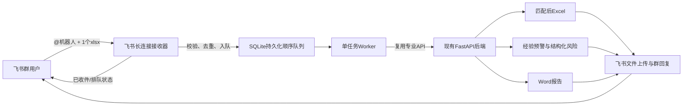

# 智能协同第二层本机长连接机器人设计规格

## 1. 目标与本期边界

本期在既有“造价智算”专业能力之外增加一个独立的飞书企业自建应用机器人进程。用户在任意已添加机器人的群聊中 `@机器人`，并在同一条消息中附带一个 `.xlsx` 文件后，机器人自动接收文件、排队处理、完成价格匹配与风险识别、生成 Excel 和 Word 报告，并把结果返回原群。

本期是本机长连接试点，采用单机、单任务顺序队列。现有填价、匹配、预警、工作量抓取、问问智算、Excel、Word、绿色版、网页开发版和 Tauri 开发资产均保持原有业务边界；飞书不可用时不得阻断本地主流程。

本期不实现审批、多维表格台账、风险派单、用户角色权限、群内逐行改值、多文件任务、多机高可用和交互卡片回调。

## 2. 已确认使用方式

- 接入方式：飞书企业自建应用机器人，使用 Python SDK 长连接接收事件，不开放公网回调地址。
- 使用范围：任何已添加该机器人的群聊均可发起任务，不设置群白名单。
- 触发条件：同一条群消息中必须 `@机器人`，且只包含一个 `.xlsx` 文件。
- 排队方式：全局单任务顺序队列；后续任务按接收顺序等待。
- 处理口径：优先使用 `config/project-default-settings.json` 的项目默认设置；无法可靠识别工作表、表头或字段映射时停止并提示人工处理，不猜测字段。
- 结果返回：原群只返回状态、风险摘要、处理后 Excel 和 Word 报告，不发送逐行价格和知识库内容。
- 本地留存：原始文件、过程文件、成果和任务记录保留 30 天。
- 风险能力：经验池预警和结构化风险清单为必需步骤；DeepSeek 风险说明为可选增强，失败时不影响结构化成果输出。

## 3. 总体架构

长连接进程与 FastAPI 主服务分离。飞书事件处理器只负责轻量校验、幂等判断、文件元数据登记、任务入队和快速确认，不在事件回调中执行 Excel、匹配、预警或报告生成。单 Worker 从 SQLite 队列逐个领取任务，通过现有专业 API 完成处理。

## 4. 组件职责

### 4.1 长连接接收器

- 使用飞书官方 Python SDK `lark-oapi` 建立长连接。
- 订阅消息接收事件，只接受群聊中对机器人的有效 `@` 消息。
- 解析消息附件，要求恰好一个 `.xlsx`；其他文件类型、无文件或多文件均回复明确错误，不创建业务任务。
- 使用事件 ID、消息 ID 和文件 key 组合做幂等登记。
- 创建任务后立即回复“已收件”，并告知任务编号及当前排队位置。
- 不把 App Secret、访问令牌、文件下载令牌或完整事件体写入普通日志。

### 4.2 SQLite 持久化队列

队列数据库放在 `Codex-Temp/runtime/feishu-bot/`，不进入 Git、绿色版成果数据或前端接口。至少包含：

- `tasks`：任务编号、会话 ID、消息 ID、文件 key、文件名、状态、阶段、错误摘要、创建/更新/完成时间、重试次数、输出文件位置。
- `events`：事件 ID、消息 ID、接收时间、幂等结果。
- `task_logs`：任务状态变更和脱敏操作记录，只追加不覆盖。

数据库启用唯一约束，保证重复事件不重复下载、不重复处理、不重复回传成果。进程重启后，处于中间状态的任务恢复为可重试状态，由单 Worker 继续处理；已经完成的任务不重复执行。

### 4.3 单任务 Worker

Worker 每次只领取一个可执行任务，状态流转如下：

`queued → downloading → inspecting → matching → risk → report → uploading → completed`

异常状态：

- `needs_manual`：工作表、表头或字段映射无法可靠确认，或输入不满足专业处理口径。
- `retryable_failed`：飞书下载/上传、临时网络、服务暂时不可用等可恢复故障。
- `failed`：文件损坏、格式不支持或达到重试上限的确定性失败。

可重试故障采用有限次数、带退避的重试；业务校验失败不自动重试。任何异常都必须留下脱敏原因，并向原群给出可操作的简短提示。

### 4.4 现有 FastAPI 专业能力

第二层不复制或改写价格规则，按既有接口和数据边界编排：

1. 检查文件、工作表、表头和默认字段映射。
2. 调用现有处理入口生成待匹配工作簿。
3. 调用现有批量匹配能力完成基价/单价和调整系数处理。
4. 调用现有经验池预警能力生成结构化预警结果。
5. 汇总待复核、匹配状态和预警数据，形成结构化风险清单。
6. 可选调用 DeepSeek 生成基于结构化证据的风险说明；调用失败只记录降级信息。
7. 使用现有 Excel、Word 输出能力生成最终成果。

第二层不得让大模型裁决最终价格，也不得让飞书消息内容改变既有匹配、预警或合并单元格口径。

## 5. 文件与目录

每个任务使用独立目录：

`Codex-Temp/runtime/feishu-bot/tasks/<task_id>/`

目录内按 `input/`、`work/`、`output/`、`logs/` 隔离原始文件、过程文件、最终成果和脱敏记录。输入文件永不覆盖；下载文件名进行安全化处理，实际路径由任务编号控制，不信任用户文件名中的路径字符。

每日清理超过 30 天且已结束的任务目录和对应可清理记录。正在处理、待重试或需人工处理的任务不因到期直接删除，必须先转为明确终态或由人工处理。

## 6. 配置与秘密管理

非秘密项目默认值继续集中在 `config/project-default-settings.json`，新增配置至少包括：

- 第二层机器人是否启用；
- 队列并发数，固定默认 `1`；
- 允许的扩展名，默认仅 `.xlsx`；
- 单文件大小上限；
- 本地留存天数，默认 `30`；
- 必需处理阶段和可选 DeepSeek 风险说明开关；
- 下载、上传和临时网络故障的有限重试参数。

App ID 和 App Secret 属于本机秘密，不写入项目默认配置、源代码、前端、日志、Git 或发布包。它们保存在被 Git 忽略的统一文件 `Codex-Temp/runtime/feishu-robot-settings.json` 的 `app_bot` 分区，由本机启动时读取。状态接口最多返回“已配置/未配置”和脱敏应用标识，不回显秘密。

## 7. 飞书事件与消息规则

应用后台需要启用机器人能力，订阅 `im.message.receive_v1`，并按飞书官方要求授予群聊 @ 消息、消息发送及文件下载/上传所需的最小权限。具体权限名称以实施时飞书开放平台当前控制台为准，并记录到部署说明中。

长连接启动时通过机器人信息接口取得本机器人 Open ID；群聊消息 mentions 中的 Open ID 与本机器人一致、消息来自机器人单聊，或独立 `.xlsx` 已通过同会话同发送人的收件窗口校验时，异步在原消息下方添加“了解”（`Get`）表情回应。群内普通聊天、@其他人 / 其他机器人、未开启收件窗口的独立文件和其他格式文件不添加表情；机器人身份无法确认时群聊保持静默。该调用需要 `im:message.reactions:write_only` 权限；表情回应异步、按消息 ID 去重，失败只记录运行警告，不得阻断后续校验、入队、问答或专业处理。

消息策略：

- 收件入口：仅完整 `@上传` / `@上传文件` 口令开启 1 分钟窗口；窗口外直接文件不建任务。
- 文字分流：`@知识库` 查询本地依据，`你好` 返回自我介绍；群聊完整输入“群里有几个人”“群成员”或“都有谁”时，调用群成员接口分页返回真实人数和名单；`任务` / `最近任务`、`进度 FS-任务编号`、`风险 FS-任务编号`、`高风险`、`结果 FS-任务编号`、`帮助` / `指令` 走确定性任务路由；其余文字复用 `/api/llm-chat` 大模型托底。
- 任务查询边界：只允许读取与当前消息 `chat_id` 相同的任务；跨群、跨单聊或群与单聊之间统一返回“当前会话未找到”，不得泄露任务是否存在。`结果` 仅重发 `completed` 任务原有 Excel、Word 和完成卡片，不重新执行专业链路，不更新任务状态。
- 收件成功：回复任务编号、已收件、排队位置。
- 开始处理：可合并为简短阶段通知，避免群消息刷屏。
- 需人工处理：说明无法可靠识别的项目，并提示用户在本地专业工作台处理。
- 失败：给出任务编号、失败阶段和脱敏原因，不暴露堆栈或凭证。
- 完成：先上传处理后 Excel 与 Word 报告，再发送经典格式绿色完成卡片，展示任务编号、输入文件和风险等级 / 数量摘要；配置 URL 时提供“进入造价智算”只读跳转按钮。WeAct 旧客户端不使用 `schema 2.0`；卡片失败降级为文字通知，不把已成功上传的成果误判为任务失败。

第一层 Webhook 保留，但第二层飞书任务的阶段通知和成果回复由企业应用机器人承担，避免同一任务被两个通道重复通知。

## 8. 启动、降级与恢复

- 增加独立的第二层机器人启动入口，并可由现有开发版/绿色版启动器按配置选择性拉起。
- 未配置应用凭证时，不启动长连接进程，现有 FastAPI、前端、第一层 Webhook 和所有专业功能照常运行。
- 长连接断开时自动重连；机器人进程崩溃不得带停后端或前端。
- FastAPI 暂时不可用时任务留在持久队列并进入可重试状态，不丢失原始文件和任务上下文。
- 启动时执行未完成任务恢复和超期文件清理，清理失败只记录告警，不阻塞正常接单。

## 9. “智能协同”页面增量

在现有第一层页面基础上增加第二层状态区，至少展示：

- 长连接进程状态、应用是否已配置、最近连接时间；
- 当前正在处理的任务、等待数量和最近任务列表；
- 任务编号、文件名、来源群脱敏标识、阶段、状态、时间和脱敏错误；
- 第二层启停及运维说明，但不提供秘密回显。

页面仅用于状态和运维观察，不在本期承载群聊任务的逐行结果编辑。

## 10. 安全要求

- 应用权限遵循最小授权；机器人只处理触发消息中的目标文件。
- 群回复不包含逐行价格、知识库明细、访问令牌、完整本地路径和异常堆栈。
- 运行状态 API 不返回 App ID、App Secret、tenant token 和文件 key；机器人运行控制台经当前试点授权，可显示发送人名称与 ID、群名与会话 ID、消息正文和附件名，用于业务追踪。用户名与群名解析失败时显示原始 ID；飞书长连接不提供发送者来源 IP，日志明确标注平台未提供。
- 原始 SDK 日志不得直接下发；连接票据、access key、完整 WebSocket URL、App Secret、访问令牌和文件 key 始终不得进入控制台。
- 所有下载文件校验扩展名、实际可读性、大小限制和安全文件名；不执行用户文件中的宏或外部程序。
- 任务目录、秘密文件和 SQLite 数据库必须被 Git、代码存档和发布扫描排除。
- 现有专业接口保持原有校验；机器人不获得绕过匹配规则或人工复核边界的特殊权限。

## 11. 验证与验收

### 11.1 自动化验证

- 使用 Mock 飞书事件覆盖：两个上传口令、1 分钟窗口、窗口外文件、无 @ 群消息、多文件、错误扩展名、重复事件、知识库、问候、三条群成员确定性指令、第一梯队任务指令、跨会话隔离、成果重发、群成员接口分页、大模型托底和表情范围。
- 验证 SQLite 唯一约束、任务状态机、单任务顺序、进程重启恢复、有限重试和 30 天清理边界。
- 使用 Mock 下载/上传和消息发送，验证收件、失败、需人工处理、完成及两个成果附件回传。
- 使用现有样例跑完整专业链路，核对 Excel、Word、匹配结果、经验预警和结构化风险清单。
- 验证 DeepSeek 不可用时仍能生成结构化结果和两个成果文件。
- 扫描源代码、前端产物、日志、Git 变更和发布目录，确认不含应用秘密。

### 11.2 全量回归

- `python -m pytest backend/tests -v`
- `npm run frontend:build`
- `python tools/check_prd_consistency.py`
- 按启动器/绿色版改动范围执行其既有编译、健康检查和启动验证。
- 回归现有填价、匹配、预警、工作量抓取、问问智算、Excel、Word、第一层 Webhook、绿色版和桌面开发资产，确认第二层失败不会改变这些功能结果。

### 11.3 人工飞书验收

1. 在“智算测试”群添加企业自建应用机器人并完成权限配置；禁止向“[管勘智算]勘察测量投标限价智能体”群投递测试消息。
2. 群内发送 `@机器人 @上传`，确认收到 1 分钟提示；随后发送一个标准 `.xlsx`，确认快速收到任务编号。
3. 连续提交两个任务，确认严格按顺序处理。
4. 重发同一事件，确认不重复建任务或回传成果。
5. 确认最终返回 Excel、Word 和风险摘要，文件可正常打开。
6. 提交无法识别字段的表，确认停止并提示人工处理，不猜测映射。
7. 模拟网络、DeepSeek 和后端短时故障，确认分别按设计重试或降级。

## 12. 实施顺序

1. 建立本地秘密配置、非秘密默认配置、SQLite 模型和任务目录约定。
2. 实现飞书 SDK 适配层、事件解析、幂等入队和消息/文件 API 封装。
3. 实现单 Worker 状态机和现有 FastAPI 专业链路编排。
4. 实现风险汇总、成果上传、群回复、重试、恢复和清理。
5. 增加后端运维状态 API 和“智能协同”第二层状态界面。
6. 接入开发版/绿色版可选启动和降级逻辑。
7. 完成自动化、全量回归、真实飞书验收说明、README、PRD、CHANGELOG 和版本收尾。

## 13. 官方参考

- [飞书机器人概述](https://open.feishu.cn/document/client-docs/bot-v3/bot-overview?lang=zh-CN)
- [事件订阅配置](https://open.feishu.cn/document/server-docs/event-subscription-guide/event-subscription-configure-/request-url-configuration-case?lang=zh-CN)
- [Python SDK 处理事件回调](https://open.feishu.cn/document/server-side-sdk/python--sdk/handle-callbacks?lang=zh-CN)
- [Python SDK 开发前准备](https://open.feishu.cn/document/server-side-sdk/python--sdk/preparations-before-development)
- [即时消息常见问题](https://open.feishu.cn/document/server-docs/im-v1/faq?lang=zh-CN)
