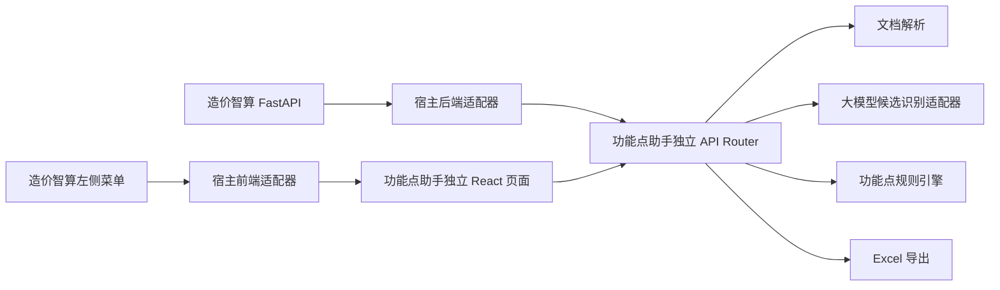

# 数字化项目造价助手——功能点法计算助手 PRD

## 1. 文档定位

本文件是“数字化项目造价助手——功能点法计算助手”的独立产品设计与开发依据。

功能点助手当前临时挂载在“造价智算”中运行，但它不是造价智算内部业务代码的一部分。造价智算只提供左侧菜单入口、公共 UI 视觉变量和必要的宿主适配；功能点助手的前端页面、后端接口、文档解析、功能点识别、规则引擎、提示词、测试、模板、运行数据、版本号和项目文档全部独立维护在：

```text
80-【子模块】功能点助手/
```

未来独立发布时，应能够移除造价智算宿主适配层，补充独立应用壳后继续使用原有业务代码和规则资产，不做业务代码搬迁。

## 2. 产品定位

### 2.1 产品名称

- 产品族：数字化项目造价助手
- 当前子产品：功能点法计算助手
- 当前版本规划：v0.1.0
- 当前阶段：独立子项目初始化与 MVP 设计

### 2.2 一句话定位

> 读取数字化、信息化项目技术文档，辅助识别功能点，经人工确认后按集团计价依据完成软件规模、工作量和软件开发费用测算，并导出可复核的功能点明细表与费用测算表。

### 2.3 目标用户

- 数字化、信息化项目投资估算编制人员。
- 招标控制价、结算审核和造价咨询人员。
- 项目可研、需求分析和技术方案编制人员。
- 需要核对软件开发费测算依据的复核、评审人员。

### 2.4 核心价值

- 把非结构化项目文档转成可复核的功能点计数明细。
- 将大模型限制在“候选识别与证据提取”，不让模型自由计算金额。
- 将集团功能点法公式、权重和调整因子固化为确定性规则。
- 保留人工确认环节，避免系统边界、复用程度和平台类型不清时强行定值。
- 输出接近集团附表 9、附表 10 的 Excel 成果，便于继续编制、审核和归档。

## 3. 已确认的 MVP 范围

### 3.1 输入

第一版支持：

- `.docx`
- 文本型 `.pdf`
- `.txt`
- `.md` / `.markdown`

扫描型 PDF 若无法提取有效正文，应明确提示需要 OCR 或人工补充文本；v0.1.0 不内置复杂 OCR 服务。

### 3.2 处理

```text
文档本地解析
→ 资料完整性与系统边界线索检查
→ 大模型提取 ILF / ELF / EI / EO / EQ 候选及证据
→ 候选标准化与重复项提示
→ 人工确认、修改、删除或补充
→ 人工确认项目阶段与调整因子
→ 规则引擎计算 UFP、US、S、AE、P
→ 生成可下载 Excel
```

### 3.3 输出

v0.1.0 至少生成一个 Excel 工作簿，包含：

1. `功能点计算明细`：参考集团附表 9，展示系统、模块、功能描述、功能点类型、计数项、证据、UFP、复用程度、修改类型、RUF、MTF、US 和人工确认状态。
2. `软件开发费用测算`：参考集团附表 10，展示五类功能点数量、UFP、US、CF、S、PDR、SWF 分项、RDF、AE、HM、F、采购费及其他和软件开发费用 P。

网页端同时展示计算摘要和待人工确认项，但 v0.1.0 不单独建设完整风险清单、审核报告和专家协同流程。

## 4. 业务依据与计算口径

### 4.1 主口径

默认依据：国家管网集团《数字与信息化项目投资计价依据（2024版）》。

口径优先级：

1. 集团正式计价依据。
2. 集团内部补充解释和审查口径。
3. 国家标准。
4. 地方标准和行业基准。

外部标准只能补强识别和合理性说明，不得静默覆盖集团取值。

### 4.2 功能点类别

| 类型 | 中文名称 | 核心判断 |
| --- | --- | --- |
| ILF | 内部逻辑文件 | 系统边界内，由本系统维护和使用的用户可识别业务数据 |
| ELF | 外部逻辑文件 | 由其他系统维护，本系统只引用；外部资料中的 EIF 与 ELF 同义映射 |
| EI | 外部输入 | 来自边界外，用于维护 ILF 或改变系统行为 |
| EO | 外部输出 | 向边界外输出，且包含计算、衍生数据、维护 ILF 或改变系统行为 |
| EQ | 外部查询 | 向边界外展示已有数据，可筛选、分组、排序，但不包含 EO 的额外处理逻辑 |

数据库物理表、编码表、字典表、参数表和技术中间表不得仅凭名称自动计为 ILF。

### 4.3 功能点计算

预估功能点法：

```text
UFP = 35 × ILF + 15 × ELF
```

估算功能点法：

```text
UFP = 10 × ILF + 7 × ELF + 4 × EI + 5 × EO + 4 × EQ
```

### 4.4 软件规模、工作量和费用

```text
US = UFP × RUF × MTF
S  = US × CF
SWF = 应用类型因子 × 软件完整性级别因子 × 非功能性特征因子
非功能性特征因子 = （分布式处理 + 性能 + 可靠性 + 多重站点）× 0.025 + 1
AE = （S × PDR）× SWF × RDF
P  = AE ÷ HM × F + 采购费及其他
```

集团固定参数：

| 参数 | 默认值 | 说明 |
| --- | --- | --- |
| PDR | 9.34 | 人时/功能点 |
| HM | 176 | 人时/人月 |
| F | 4.287 | 万元/人月 |

### 4.5 调整因子

- RUF：高复用 `0.33`、中复用 `0.67`、低复用 `1.00`。
- MTF：新增 `1.0`、修改 `0.8`、删除 `0.2`。
- CF：可研阶段 `1.39`、实施阶段 `1.21`、项目交付后 `1.00`。
- 应用类型因子：业务处理 `1.0`、科技 `1.2`、多媒体 `1.3`、智能信息 `1.5`、基础软件/支撑软件 `1.7`、通信控制 `1.9`、流程控制 `2.0`。
- 软件完整性级别因子：无明确级别或 C/D 为 `1.0`，A/B 且采取特殊措施为 `1.1`，A 级且全生命周期采取明确措施为 `1.3`。
- RDF：C 同级平台 `1.2`，Java/C++/C# 同级平台 `1.0`，PowerBuilder/ASP 同级平台 `0.8`。

Python、低代码、云原生平台和大模型工作流编排平台没有明确集团映射时，必须进入人工确认，不能通过程序默认值冒充正式口径。

## 5. 独立架构设计

### 5.1 采用方案

采用“独立包挂载到造价智算”的方式。



### 5.2 宿主仅允许保留的内容

造价智算主项目中只允许存在：

- 左侧菜单项：位于“智能协同”下方。
- 一个薄前端挂载适配器或路由注册点。
- 一个薄后端 Router 注册点。
- 公共 UI token、通用图标和布局容器的复用关系。
- 绿色版或桌面版打包时复制独立子项目所需文件的清单。

宿主适配器不得包含功能点分类、文档解析、公式、规则、提示词、Excel 模板或业务状态机。

功能点助手实现阶段由新的 Codex 项目以 `80-【子模块】功能点助手` 为工作区根目录。该开发项目默认无权修改父级造价智算的 `frontend/`、`backend/`、`config/`、版本文件和 PRD；宿主菜单与挂载适配由后续独立接入任务处理。

### 5.3 独立子项目拥有的内容

- React 页面、组件、状态和 API client。
- FastAPI Router、服务层和数据模型。
- DOCX、PDF、TXT、Markdown 本地解析。
- 大模型候选识别提示词和 LLM Provider 接口。
- 功能点标准化、人工确认和确定性规则引擎。
- Excel 导出模板与生成逻辑。
- 独立测试、样例、运行目录、日志和输出。
- 独立 README、AGENTS、CHANGELOG、PRD和版本号。

### 5.4 大模型解耦

功能点助手定义自己的 `LlmProvider` 接口：

- 挂载在造价智算时，由宿主适配器注入现有大模型调用能力。
- 独立运行时，由功能点助手自己的配置提供大模型连接。
- 业务服务只依赖 `LlmProvider` 协议，不直接读取造价智算内部状态、页面变量或私有函数。

大模型输出必须经过结构校验和规则引擎处理。大模型不得计算 UFP、US、S、AE 或 P。

### 5.5 API 边界

建议统一使用独立前缀：

```text
/api/feature-point-assistant/*
```

至少规划：

- `POST /jobs`：上传文件并创建任务。
- `GET /jobs/{job_id}`：读取任务状态。
- `GET /jobs/{job_id}/document`：读取解析结果与完整性信息。
- `POST /jobs/{job_id}/identify`：调用大模型生成候选。
- `PUT /jobs/{job_id}/items`：保存人工确认后的明细。
- `POST /jobs/{job_id}/calculate`：执行确定性计算。
- `GET /jobs/{job_id}/export`：下载 Excel。

接口模型和路由实现放在独立子项目；造价智算只负责挂载 Router。

## 6. 推荐目录结构

```text
80-【子模块】功能点助手/
├─ README.md
├─ AGENTS.md
├─ CHANGELOG.md
├─ pyproject.toml
├─ .env.example
├─ 00-docs/
│  └─ 00-PRD/
│     ├─ 01-功能点助手PRD.md
│     └─ 02-当前版本计划.md
├─ 01-materials-原始资料/
│  ├─ 集团计价依据/
│  ├─ 规则与审核清单/
│  └─ 测试样例来源/
├─ 02-notes-知识沉淀/
│  ├─ 参考项目吸收评估.md
│  └─ 资料来源清单.md
├─ frontend/
│  ├─ package.json
│  ├─ vite.config.ts
│  └─ src/
│     ├─ FeaturePointAssistantPage.tsx
│     ├─ components/
│     ├─ api/
│     └─ styles/
├─ backend/
│  └─ feature_point_assistant/
│     ├─ api/
│     ├─ services/
│     ├─ models/
│     ├─ parsers/
│     ├─ exporters/
│     └─ llm/
├─ rules/
├─ prompts/
├─ templates/
├─ tests/
│  └─ fixtures/
├─ 04-output/
└─ Codex-Temp/
```

代码目录内部使用英文包名 `feature_point_assistant`，避免中文目录成为 Python import 名称；外层业务目录继续使用用户指定中文名。

子项目使用自己的 Python 与前端依赖清单、启动命令和版本号。独立开发默认使用不占用造价智算 `8000 / 5174` 的端口；具体端口写入子项目配置，不硬编码进业务逻辑。

## 7. UI 设计

### 7.1 宿主位置

造价智算左侧菜单顺序追加为：

```text
…… → 知识库问答 → 智能协同 → 功能点助手
```

功能点助手只在视觉上属于造价智算工作台。点击后，中间区域挂载功能点助手独立页面；宿主挂载形态继续显示右侧“问问智算”，但它只作为通用旁路助手，不读取、修改或裁决功能点助手业务状态。

### 7.2 视觉一致性

- 复用造价智算的大尾巴主题颜色 token、字体、间距、按钮、表格和状态样式。
- 功能点助手内部不得复制整套造价智算 CSS；通过公共 token 和少量适配层保持一致。
- 独立运行时提供同名默认 token，保证页面脱离宿主仍可正常显示。
- 页面保持白底、浅灰分区、1px 细边框、低圆角、无常驻阴影。

### 7.3 页面结构

1. `文档与项目参数`：上传文件，填写项目名称、规模计算方法、阶段、应用类型、完整性级别、开发平台和采购费及其他。
2. `资料解析结果`：展示文件名、文本长度、章节、完整性、系统边界线索和缺失项。
3. `功能点候选表`：展示模块、功能项、类型、证据、RUF、MTF、置信度和确认状态；支持人工修改、删除和新增。
4. `测算结果`：展示五类计数、UFP、US、S、AE、P 和全部参数来源。
5. `导出操作`：下载附表 9、附表 10 式 Excel。

候选未经人工确认时，可以预览试算，但不得标记为“正式测算结果”。

## 8. 关键数据对象

### 8.1 任务

- `job_id`
- `project_name`
- `status`
- `input_filename`
- `input_format`
- `calculation_method`
- `created_at`
- `updated_at`

### 8.2 功能点明细

- `item_id`
- `module_name`
- `subsystem_name`
- `feature_name`
- `fp_type`
- `evidence_text`
- `evidence_location`
- `boundary_basis`
- `reuse_level`
- `ruf_value`
- `modification_type`
- `mtf_value`
- `ufp_value`
- `us_value`
- `confidence`
- `confirmation_status`
- `review_note`

### 8.3 测算参数

- `project_stage`
- `cf`
- `application_type`
- `application_factor`
- `integrity_level`
- `integrity_factor`
- 四项非功能性特征分值及因子。
- `swf`
- `platform_type`
- `rdf`
- `pdr`
- `hm`
- `f`
- `purchase_cost`

### 8.4 测算结果

- 五类功能点数量。
- `ufp_total`
- `us_total`
- `s_total`
- `ae_total`
- `development_cost`
- `purchase_cost`
- `price_total`
- `calculation_trace`

## 9. 状态与异常处理

| 状态 | 说明 |
| --- | --- |
| 待上传 | 尚无输入文件 |
| 解析中 | 正在本地提取正文 |
| 待补件 | 正文为空、扫描 PDF 或缺少最低业务信息 |
| 待识别 | 文档可用，尚未调用大模型 |
| 识别中 | 正在提取候选 |
| 待确认 | 已有候选，等待人工处理 |
| 可计算 | 所有必填参数和必要候选已确认 |
| 已计算 | 已生成确定性测算结果 |
| 已导出 | 已生成 Excel 成果 |
| 失败 | 当前步骤失败，可重试且不覆盖原始文件 |

任何模型、解析或导出失败不得污染原始输入和已确认明细。重新识别不得静默覆盖人工修改，必须由用户选择保留、合并或重置。

## 10. 需求清单

| 状态 | 需求 | 验收口径 |
| --- | --- | --- |
| [待开发] | 独立子项目与宿主薄适配 | 除菜单、Router 注册、公共 UI token 和打包清单外，业务代码全部位于 `80-【子模块】功能点助手`；移除宿主适配后，独立代码仍完整 |
| [待开发] | DOCX/PDF/TXT/Markdown 本地解析 | 四类文本型文档可以提取正文；扫描 PDF 明确提示 OCR / 补充文本，不返回空白成功 |
| [待开发] | 资料完整性和边界线索检查 | 展示系统边界、模块、数据对象、输入输出线索和缺失项；资料不足时阻止生成正式结果 |
| [待开发] | 大模型功能点候选识别 | 输出 ILF/ELF/EI/EO/EQ、直接证据、边界依据和置信度；无证据不得编造候选 |
| [待开发] | 功能点明细人工确认 | 支持修改类型、证据、RUF、MTF，支持新增、删除和确认；重新识别不覆盖人工结果 |
| [待开发] | 确定性功能点与费用计算 | 严格执行 UFP、US、S、AE、P 公式；未知平台映射必须人工确认；大模型不参与数值运算 |
| [待开发] | 附表 9 / 附表 10 式 Excel 导出 | 一个工作簿至少含功能点明细和费用测算两个 sheet；数值、公式说明、参数来源和页面结果一致 |
| [待开发] | 独立运行数据和版本管理 | 输入副本、解析结果、人工确认、测算结果、导出和日志保存在子项目运行目录；使用独立版本号和 CHANGELOG |
| [待开发] | 造价智算左侧 UI 入口 | 菜单位于“智能协同”下方；视觉与大尾巴主题一致；宿主现有模块不受影响 |
| [暂缓] | OCR、完整审核风险清单、多人协同和独立发布壳 | v0.1.0 不建设；后续独立立项，不夹带进入当前 MVP |

## 11. 参考项目吸收与排除

参考来源：

```text
D:\Sync-Code\Codex\260430-数字化项目结算审核智能体
```

只吸收功能点法业务知识、规则拆解、审核经验、提示词约束、测试样例思路和期望输出，不复用 HiAgent 的开发实现方式。

### 11.1 计划复制的业务资料

- 集团《数字与信息化项目投资计价依据（2024版）》PDF。
- 功能点法学习拆解。
- 功能点法规则表。
- 功能点术语映射与口径差异表。
- 功能点法审核清单。
- 结构化规则 JSON，作为业务规则迁移参考，进入开发前重新校核和版本化。
- 功能点候选提取提示词，作为提示词迁移参考，按新 API 数据结构改写。
- 脱敏技术文档样例与候选结果样例，用于新项目测试基线。
- 原 smoke test 的预期结果摘要，用于核对迁移后算法口径。

复制后必须保留来源清单和“原始参考、不可直接修改”的标识。

复制到新子项目时，历史文件名中的 `-【codex】` / `【codex】` 标识应在不产生重名的前提下移除；来源清单保留原始路径和原始文件名，确保可追溯但不把工具标识延续到新项目文件名。

### 11.2 明确不复制的实现资产

- HiAgent / WeAgent 平台帮助文档、API 文档和界面截图。
- HiAgent 工作流 JSON、YAML、ZIP 导入包。
- HiAgent 工作流生成脚本、导入包生成脚本和平台节点配置。
- `handler(params)` 平台代码节点实现。
- HiAgent 模型 ID、租户 ID、工作区 ID和平台私有配置。
- `Codex-Temp`、`__pycache__`、`.pyc`、无扩展名缓存、派生导出和历史压缩包。
- 飞书插件和 Markdown 转 XLSX 的平台插件示例。

这些文件只用于确认旧项目的经验边界，不进入新子项目。

## 12. 功能边界

- 本助手计算数字化、信息化项目的软件功能规模、工作量和软件开发费用，不负责造价智算的管道勘察测量价格匹配。
- 不调用或修改造价智算二维价格库、匹配规则、经验池、人工填价和 Word 报告链路。
- 不把大模型候选直接作为正式功能点计数；必须允许人工确认。
- 不自动决定存在争议的开发平台映射和缺乏证据的调整因子。
- 不覆盖用户原始输入文件，所有解析和输出使用任务副本。
- 不把采购、实施、测评、培训等所有数字化项目费用都混入软件开发费；采购费及其他仅按附表口径单独输入和计列。
- v0.1.0 不实现扫描件 OCR、完整结算审核、风险清单、专家协同和自动报告。

## 13. 验收与测试

### 13.1 业务验收

- 四类输入格式均有可用样例。
- 同一文档经人工确认后，页面与 Excel 的功能点数量、UFP、US、S、AE、P 一致。
- 预估法和估算法分别有独立测试。
- RUF、MTF、CF、SWF、RDF 的每类合法取值均有测试。
- ELF / EIF 同义映射正确。
- 查询类功能不会因仅有展示描述而自动归为 EO。
- 未知平台映射、缺少系统边界和扫描 PDF 不会生成伪正式结果。

### 13.2 独立性验收

- 搜索造价智算宿主代码时，不存在功能点公式、权重、分类规则和提示词复制件。
- 功能点助手拥有独立 README、AGENTS、CHANGELOG、PRD、测试和版本号。
- 宿主仅通过公开组件、Router 和 provider 接口挂载。
- 将子项目复制到新的 Codex 项目后，核心业务代码、规则、测试和文档完整，不依赖 `frontend/src/App.tsx` 或 `backend/app` 中的私有实现。

### 13.3 回归验收

- 造价智算现有填价、预览、经验池、工作量、Word 报告、知识库问答和智能协同不受影响。
- 功能点助手失败不会导致宿主启动失败；宿主可显示模块不可用提示。
- 造价智算前端构建和后端回归通过。
- 子项目自己的单元测试、规则测试、文档解析测试和 Excel 导出测试通过。

## 14. 版本规划

### v0.1.0

- 独立目录和宿主薄适配。
- DOCX、文本 PDF、TXT、Markdown 解析。
- 大模型候选提取。
- 人工确认功能点明细。
- 集团口径确定性计算。
- 附表 9 / 附表 10 式 Excel 导出。

### 后续版本储备

- OCR 与图片型材料识别。
- 系统边界图和重复计数深度检查。
- 完整审核风险清单。
- WBS / 人月法交叉校核。
- 多方案和行业基准区间对照。
- 独立应用壳、独立部署和独立品牌入口。

## 15. 当前阶段交付顺序

1. 用户审阅并确认本 PRD。
2. 初始化独立 README、AGENTS、CHANGELOG 和当前版本计划。
3. 按第 11 节白名单复制业务资料，并生成来源清单和吸收评估。
4. 将根项目 `14-功能点助手模块/PRD.md` 收敛为唯一入口，不在根 PRD 复制详细需求。
5. 为新的 Codex 开发项目生成独立开发提示词和实施计划。
6. 新 Codex 项目只在 `80-【子模块】功能点助手` 内开发业务代码；造价智算宿主接入另设薄适配任务。
